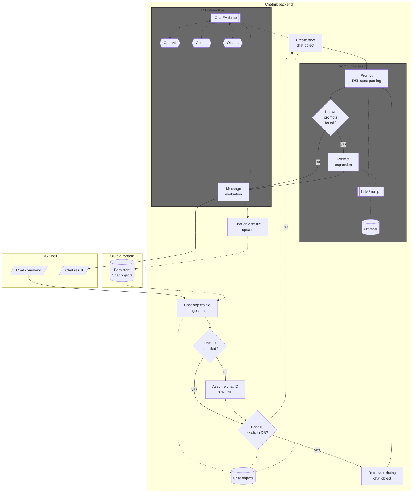
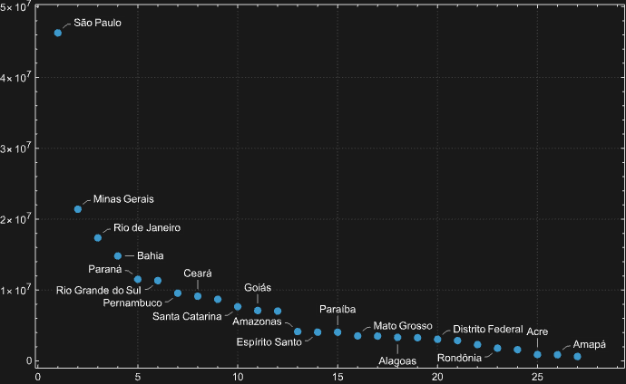

# Chatnik: LLM Host in the Shell -- Part 1: First Examples & Design Principles

## Introduction

["Chatnik"](https://resources.wolframcloud.com/PacletRepository/resources/AntonAntonov/Chatnik/), [AAp9], 
is a Wolfram Language (WL) paclet that provides Command Line Interface (CLI)
scripts for conversing with multiple, persistent Large Language Model (LLM) personas. 
Files of the host Operating System (OS) are used to maintain persistence.

Most importantly, "Chatnik" does not try to entrench users in its own user experience (loop) for interaction with LLMs.
Instead, it brings customizable LLM invocations and conversations into the Unix shell -- 
making them composable, integratable, and scriptable with existing workflows.

In other words, the tag line "LLM Host in the Shell" should be understood as "LLMs, not as an app -- but as a Unix shell primitive." 

Here are the most notable "Chatnik" features:

- Provides UNIX shell pipelining for LLM interactions
- Maintains a database of LLM chat objects
- Connects to multiple models across different LLM providers
- Offers access to a large repository of prompts
- Enables convenient retrieval of interaction history
- Includes management tools for the LLM chat object database
- Preprocesses prompts using a simple domain-specific language (DSL)
- Supports loading user-defined LLM personas from JSON files

**Remark:** "Chatnik" closely follows the LLM-chat objects interaction system of the Python package ["JupyterChatbook"](https://pypi.org/project/JupyterChatbook/), [AAp3], 
and Raku package ["Jupyter::Chatbook"](https://raku.land/zef:antononcube/Jupyter::Chatbook), [AAp7]. 
Another (remote) resemblance can be found with the Wolfram Language paclet ["Chatbook"](https://resources.wolframcloud.com/PacletRepository/resources/Wolfram/Chatbook/), [CGp1]. 
(In other words, using OS shells instead of Jupyter or Wolfram notebooks.)

**Remark:** The WL paclet "Chatnik", [AAp9], is a translation of the Raku package ["Chatnik"](https://github.com/antononcube/Raku-Chatnik), [AAp8]
and the Python package ["Chatnik"](https://pypi.org/project/Chatnik/), [AAp4].
The WL CLI scripts are with CamelCase, i.e. `LLMChat`, `LLMChatMeta`, and `LLMPrompt`.
The corresponding CLI scripts of the Raku package use kebab-case, i.e. `llm-chat`, `llm-chat-meta`, and `llm-prompt`.
The corresponding CLI scripts of the Python package use snake_case, i.e. `llm_chat`, `llm_chat_meta`, and `llm_prompt`.

**Remark:** In addition, the Raku package provides the "umbrella" CLI `chatnik`.

**Remark:** When the phrase "Chatnik system" is used that is in order to emphasize that there are "Chatnik" packages in several programming languages with (almost) the same design and usage.

The rest of this document is organized as follows:

- Introductory examples
- Why make another LLM-CLI system?
- Architectural design
- Related and alternative packages

----

## Introductory examples

The examples in this section demonstrate how the CLI scripts `LLMChat` and `LLMChatMeta` -- provided by "Chatnik" -- 
are used to have multi-turn LLM conversations and compose Unix shell pipelines with LLM interaction messages.

**Remark:** In order to use these scripts use the function [`ChatnikCopyScripts`](https://resources.wolframcloud.com/PacletRepository/resources/AntonAntonov/Chatnik/ref/ChatnikCopyScripts.html)  
after installing "Chatnik".

**Remark:** The prompts used in the examples are provided by the [Wolfram Prompt Repository (WPR)](https://resources.wolframcloud.com/PromptRepository/).
Many of those prompts are also available in Python and Raku via the packages ["LLMPrompts"](https://pypi.org/project/LLMPrompts), [AAp2], and ["LLM::Prompts"](https://raku.land/zef:antononcube/LLM::Prompts), [AAp6], respectively.

### Chat with Yoda

Here we create an LLM persona -- by naming it and "priming it" with a prompt -- and start interacting with it:

```shell
LLMChat 'Hi! Who are you?' --chat-id=yoda --prompt=@Yoda 
```
```
# Yoda, I am. Wise and old Jedi Master, yes. Help you with the Force, I will. Hmm.
```


Here we continue the conversation -- using the `--i` synonym of `--chat-id`:

```shell
LLMChat 'How many students did you have?' --i=yoda 
```
```
# Many students, I have trained in my long life. Countless, they are. Luke Skywalker, young Anakin, and others, yes. Teach them the ways of the Force, I did. Hmm. Important balance, training Jedi is. Patience and wisdom, the path to success they are.
```

And continue the discussion some more: 

```shell
LLMChat 'Which student is the best?' --i=yoda 
```
```
# Best student, difficult to say, it is. Each has strengths and weaknesses, hmmm. Luke Skywalker, strong in the Force he is. Anakin, powerful but troubled, hmmm. Learn from mistakes, all must. Judge by heart and actions, we should. Humble and wise, the true measure of a Jedi is. Yes.
```

The example used the LLM persona ["Yoda"](https://resources.wolframcloud.com/PromptRepository/resources/Yoda).
(See more LLM personas [here](https://resources.wolframcloud.com/PromptRepository/category/personas?sortBy=Name).)

### Fortune-echo-limerick pipeline

Here we specify a pipeline for
1. Getting a fortune
2. Echoing it
3. Using the fortune to make a limerick


```
fortune | tee /dev/tty | LLMChat --prompt="Make a limerick from the given text:"
```

```text
I have made this letter longer than usual because I lack the time to
make it shorter.
		-- Blaise Pascal
		
There once was a note, quite verbose,  
Longer than needed, I suppose.  
Pascal said with a grin,  
“To be short takes more spin,”  
So brevity’s craft he chose to oppose.
```

**Remark:** In the shell command above, `LLMChat` created (or reused) a chat object with the default identifier "NONE". 

### Make a diagram from previous results

Here we use prompt expansion to request the creation of a [Mermaid-JS diagram](https://mermaid.js.org) via the
prompt ["CodeWriterX"](https://www.wolframcloud.com/obj/antononcube/DeployedResources/Prompt/CodeWriterX/):

```
LLMChatMeta last-message --i=NONE | LLMChat - --i=mmd --prompt='Make a mermaid.js sequence diagram #NothingElse|"mermaid.js code"'
```

````
```mermaid
sequenceDiagram
    participant Blaise as Blaise Pascal
    participant Note as Note
    participant Reader as Reader

    Blaise->>Note: Write verbose letter
    Note->>Reader: Deliver longer-than-usual message
    Blaise->>Reader: "To be short takes more spin"
    Note->>Reader: "Brevity's craft opposed"
```
````

Since the result is given in Markdown code fences we take the last message via the CLI script `LLMMetaChat`,
then use `sed` to remove the first and last lines, and then pass that text to the terminal 
Mermaid-JS visualizer [`mmdflux`](https://github.com/kevinswiber/mmdflux):

```
LLMChatMeta last-message --i=mmd | sed '1d; $d' | mmdflux
```

```text
┌───────────────┐                        ┌──────┐                            ┌────────┐
│ Blaise Pascal │                        │ Note │                            │ Reader │
└───────┬───────┘                        └───┬──┘                            └────┬───┘
        │                                    │                                    │
        │─Write verbose letter──────────────>│                                    │
        │                                    │                                    │
        │                                    │─Deliver longer-than-usual message─>│
        │                                    │                                    │
        │─"To be short takes more spin"──────────────────────────────────────────>│
        │                                    │                                    │
        │                                    │─"Brevity's craft opposed"─────────>│
        │                                    │                                    │
```

**Remark:** Since the result is usually given in Markdown code fences, we did not make a pipeline to plot the diagram.
We used two shell commands in order to observe the intermediate result.

**Remark:** The default object identifier for both `LLMChat` and `LLMChatMeta` is "NONE".

### Copy-editing

Here is a very practical example --
this document was copy-edited with the prompt ["CopyEdit"](https://resources.wolframcloud.com/PromptRepository/resources/CopyEdit) 
using the following commands:

```
cat Chatnik-LLM-Host-in-the-Shell-Part-1.md | LLMChat - --i=ce --prompt=@CopyEdit --model=gpt-5.4-mini --max-tokens=16384
LLMChatMeta  last-message --i=ce > Chatnik-LLM-Host-in-the-Shell-Part-1_edited.md
open Chatnik-LLM-Host-in-the-Shell-Part-1_edited.md
```

(And, yes, the LLM copy-edited version was evaluated, and some edits were rejected.)

---

## Why make another LLM-CLI system?

### Some questions to answer

* Why do it?
* Why was it relatively easy to do?
* Why is it useful?

### Why do it?

Most LLM interfaces -- both "big" popular ones and those built by developers experimenting with LLMs -- default to an application-centric design: a closed interaction loop with implicit state. 
This pattern is convenient, but very limiting. It can be cynically seen as an intentional effort for user lock-in or just as an attempt to impose certain user-experience views.
It works against the "freedom enabling" Unix design principles. (Such as composability, transparency, and scriptability.)

With "Chatnik", instead of adapting workflows to fit an LLM application, LLM capabilities are brought into the shell as first-class primitives.
This enables reuse of existing tooling (pipes, redirects, scripts) and aligns LLM interaction with long-established UNIX practices.

### Why was it relatively easy to do?

"Chatnik" is a composition of existing capabilities rather than a ground-up implementation:

* Modern LLM providers (e.g., OpenAI, Google, Ollama) expose messy, non-uniform APIs that should be abstracted behind a single interface
* The Raku ecosystem already provides flexible text processing, DSL making and usage, and CLI tooling
* The "LLM::Functions" package encapsulates model interaction patterns, reducing knowledge of concrete APIs
* Persistence can be implemented with simple file-based storage, avoiding the need for complex infrastructure

**Remark:** Related to the last point above, the following quote is attributed to [Ken Thompson](https://en.wikiquote.org/wiki/Ken_Thompson) about UNIX:

> We have persistent objects, they're called files.

**Remark:** Less obnoxiously, instead of saying that LLM providers expose messy, non-uniform APIs, we can say that their APIs "are individually reasonable, but collectively inconsistent."
Because of the popularity of OpenAI's models, many LLM providers adhere to a degree with OpenAI's API.
Still, the APIs -- collectively -- have inconsistent schemas, authorization, streaming, tool-calling, roles, etc.

### Why is it useful?

"Chatnik" is useful because it places LLM capabilities in a natural manner into Unix shell workflows:

* LLM calls can be embedded into shell pipelines, enabling automation and chaining
* Conversations are persistent and inspectable via the file system
* Prompt reuse and DSL preprocessing reduce repetition and keep workflows clear
* Multiple providers can be used interchangeably without changing workflows
* Existing UNIX tools (e.g., `grep`, `awk`, `sed`) can be combined with LLM outputs
  * Also, additional "widgets", like Markdown viewers, Mermaid-JS renderers, etc. 

----

## Architectural design

The following flowchart summarizes the computational components and their interactions fairly well:



Here is a concise narration of the flow:

- A chat command is issued from the OS shell, triggering ingestion of the chat objects file into an in-memory chat database.

- If a chat ID is specified and exists, the corresponding chat object is retrieved; otherwise, a new chat object is created (with a default “NONE” ID if unspecified).

- The input is then processed through prompt parsing using a DSL. If known prompts are detected, they are expanded via the prompt repository; otherwise, the raw input proceeds directly.

- The resulting message is evaluated through "LLM::Functions", which mediates interaction with external providers such as OpenAI (ChatGPT), Google (Gemini), and Ollama.

- The evaluation produces a chat result returned to the shell, while the updated chat state is written back to the chat objects file, ensuring persistence.

### Expanded narration

**Chatnik is built around the principle that LLM interaction should behave like a native shell capability, not a siloed application.**   
A command issued in the OS shell is treated as the entry point into a composable pipeline, where LLM calls can participate alongside standard UNIX tools.

**State is externalized and file-backed, not hidden in process memory.**   
Chat sessions are represented as chat objects that are ingested from and persisted to the file system. 
This makes conversations durable, inspectable, and naturally versionable using existing OS tools.

**Chat identity is explicit but optional.**   
When a chat ID is provided, the corresponding conversation is resumed; when absent or unknown, a new chat object is created. 
This allows both ad-hoc interactions and long-lived conversational contexts without friction.

**Prompting is treated as a programmable layer.**   
Inputs are not passed directly to models; they are first parsed through a lightweight DSL. 
Known prompts are expanded from a prompt repository, enabling reuse, parameterization, and standardization of interactions.

**LLM invocation is abstracted but not obscured.**   
Evaluation is delegated to "LLM::Functions", which provides a uniform interface over multiple providers, including OpenAI (ChatGPT), Google (Gemini), and Ollama. 
This keeps provider choice flexible while preserving a consistent workflow.

**The system is designed for composability and integration.**   
Each stage—state ingestion, prompt processing, evaluation, and persistence—can be understood as part of a pipeline. 
This makes LLM interactions scriptable, chainable, and interoperable with existing command-line utilities.

**Persistence is a first-class outcome of every interaction.**  
Every evaluation both returns a result to the shell and updates the underlying chat object store, ensuring that conversational context evolves incrementally and reliably.

**In short.** To reiterate the point in the introduction, "Chatnik" treats LLMs as *shell-native, stateful, and programmable primitives* -- 
aligning conversational AI with the philosophy of UNIX pipelines rather than application-bound interfaces.

-----

## Related functions and packages

In this section, we point to Raku packages that are both ingredients of, and alternatives to, "Chatnik".

### Main ingredients

The LLM-chat object functionalities (creation and interaction) are provided by the Wolfram Language functions
[`LLMConfiguration`](https://reference.wolfram.com/language/ref/LLMConfiguration.html), [WRIf1],
[`LLMPrompt`](https://raku.land/zef:antononcube/LLM::Functions), [WRIf2], and
[`LLMSynthesize`](https://reference.wolfram.com/language/ref/LLMSynthesize.html), [WRIf3].
In addition, the expansion of the [prompt DSL](https://writings.stephenwolfram.com/2023/06/introducing-chat-notebooks-integrating-llms-into-the-notebook-paradigm/#applying-functions-in-a-chat-notebook), [SW1], is done by the function
[`ChatnikPromptExpand`](https://resources.wolframcloud.com/PacletRepository/resources/AntonAntonov/Chatnik/ref/ChatnikPromptExpand.html).

The CLI script `LLMPrompt` of "Chatnik" can be used to examine, retrieve, and concretize prompts. 
For example, here it can be seen the full text of the function prompt "MermaidDiagram" with given arguments:

```
LLMPrompt MermaidDiagram MYTEXT MY_DIAGRAM_TYPE
```

In some cases it is more convenient to use `LLMPrompt` than prompt expansion. For example:

```
LLMChat "FOCUS TEXT START :: $(cat README.md) :: FOCUS TEXT END" | LLMChat - --i=fb --prompt="$(LLMPrompt ThinkingHatsFeedback 'FOCUS TEXT')"
```

Here is the context (prompt) of the chat object "fb":

```
LLMChatMeta context --i=fb
```

We can see the outcome of the `LLMChat` pipeline above with:

```
LLMChatMeta last-message --i=fb | cat > chat.md
```

### Parsing of CLI arguments 

The paclet ["CommandLineParser"](https://resources.wolframcloud.com/PacletRepository/resources/Wolfram/CommandLineParser/), [MSp1],
is used to parse the CLI arguments of the "Chatnik" scripts. The parser has certain limitations:

- The non-named CLI arguments must be placed before the named ones.
- The named arguments allways start with `--`. (I.e. `-i` does not work, `--i` does.)

Because [`$ScriptInputString` is not very reliable](https://mathematica.stackexchange.com/q/204021) the positional argument `-` 
can be used to specify that the pipeline value as the input to `LLMChat`.

### Including `wolframscript`

Of course, we can utilize "full power" of `wolframscript` (or WL) by making pipelines that combine
LLM generations with WL computations. For example, here we get LLM-retrieved statistics and plot them
(using the last message of the chat with "beta" above):

```
LLMChatMeta last-message --i=beta | sed '1d; $d' | wolframscript -code 'gr=ImportString[Import["!cat", "String"],"RawJSON"]//ReverseSort//ListPlot[#, ImageSize->600, PlotTheme -> "Detailed", PlotRange->All]&; Export["./beta.png", gr]' && open ./beta.png 
```



----

## References

### Articles, blog posts

[AA1] Anton Antonov, ["Jupyter::Chatbook"](https://rakuforprediction.wordpress.com/2023/09/03/jupyterchatbook), (2023), [RakuForPrediction at WordPress](https://rakuforprediction.wordpress.com).

[AA2] Anton Antonov, ["Jupyter::Chatbook Cheatsheet"](https://rakuforprediction.wordpress.com/2026/03/14/jupyterchatbook-cheatsheet), (2026), [RakuForPrediction at WordPress](https://rakuforprediction.wordpress.com).

[AA3] Anton Antonov, ["Jupyter Chatbook Cheatsheet"](https://pythonforprediction.wordpress.com/2026/03/12/jupyter-chatbook-cheatsheet), (2026), [PythonForPrediction at WordPress](https://rakuforprediction.wordpress.com).

[AA4] Anton Antonov, ["Chatnik: LLM Host in the Shell — Part 1: First Examples & Design Principles"](https://rakuforprediction.wordpress.com/2026/04/25/chatnik-llm-host-in-the-shell-part-1-first-examples-design-principles/), (2026), [RakuForPrediction at WordPress](https://rakuforprediction.wordpress.com).

[AA5] Anton Antonov, ["Chatnik: LLM Host in the Shell — Part 1: First Examples & Design Principles"](https://pythonforprediction.wordpress.com/2026/05/04/chatnik-llm-host-in-the-shell-part-1-first-examples-design-principles/), (2026), [PythonForPrediction at WordPress](https://pythonforprediction.wordpress.com).

[SW1] Stephen Wolfram, ["Introducing Chat Notebooks: Integrating LLMs into the Notebook Paradigm"](https://writings.stephenwolfram.com/2023/06/introducing-chat-notebooks-integrating-llms-into-the-notebook-paradigm), (2023), [Stephen Wolfram Writings](https://writings.stephenwolfram.com).

### Functions

[WRIf1] Wolfram Research, Inc., [LLMConfiguration](https://reference.wolfram.com/language/ref/LLMConfiguration.html), (2023), [Wolfram Language function](https://reference.wolfram.com/language/), (updated 2025).

[WRIf2] Wolfram Research, Inc., [LLMPrompt](https://reference.wolfram.com/language/ref/LLMPrompt.html), (2023), [Wolfram Language function](https://reference.wolfram.com/language/).

[WRIf3] Wolfram Research, Inc., [LLMSynthesize](https://reference.wolfram.com/language/ref/LLMSynthesize.html), (2023), [Wolfram Language function](https://reference.wolfram.com/language/), (updated 2025).

### Packages

#### Python

[AAp1] Anton Antonov, [LLMFunctionObjects, Python package](https://github.com/antononcube/Python-packages/tree/main/LLMFunctionObjects), (2023-2026), [GitHub/antononcube](https://github.com/antononcube). ([PyPI.org page](https://pypi.org/project/LLMFunctionObjects).)

[AAp2] Anton Antonov, [LLMPrompts, Python package](https://github.com/antononcube/Python-packages/tree/main/LLMPrompts), (2023-2025), [GitHub/antononcube](https://github.com/antononcube). ([PyPI.org page](https://pypi.org/project/LLMPrompts).)

[AAp3] Anton Antonov, [JupyterChatbook, Python package](https://github.com/antononcube/Python-JupyterChatbook), (2023-2026), [GitHub/antononcube](https://github.com/antononcube). ([PyPI.org page](https://pypi.org/project/JupyterChatbook).)

[AAp4] Anton Antonov, [Chatnik, Python package](https://github.com/antononcube/Python-Chatnik), (2026), [GitHub/antononcube](https://github.com/antononcube).


#### Raku

[AAp5] Anton Antonov, [LLM::Functions, Raku package](https://github.com/antononcube/Raku-LLM-Functions), (2023-2026), [GitHub/antononcube](https://github.com/antononcube).

[AAp6] Anton Antonov, [LLM::Prompts, Raku package](https://github.com/antononcube/Raku-LLM-Prompts), (2023-2025), [GitHub/antononcube](https://github.com/antononcube).

[AAp7] Anton Antonov, [Jupyter::Chatbook, Raku package](https://github.com/antononcube/Raku-Jupyter-Chatbook), (2023-2026), [GitHub/antononcube](https://github.com/antononcube).

[AAp8] Anton Antonov, [Chatnik, Raku package](https://github.com/antononcube/Raku-Chatnik), (2026), [GitHub/antononcube](https://github.com/antononcube).

#### Wolfram Language

[AAp9] Anton Antonov, [Chatnik, Wolfram Language paclet](https://resources.wolframcloud.com/PacletRepository/resources/AntonAntonov/Chatnik/), (2026), [Wolfram Language Paclet Repository](https://resources.wolframcloud.com/PacletRepository).

[MSp1] Matteo Salvarezza, [CommandLineParser, Wolfram Language paclet](https://resources.wolframcloud.com/PacletRepository/resources/Wolfram/CommandLineParser/), (2024), [Wolfram Language Paclet Repository](https://resources.wolframcloud.com/PacletRepository).

[CGp1] Connor Gray, et al., [Chatbook, Wolfram Language paclet](https://resources.wolframcloud.com/PacletRepository/resources/Wolfram/Chatbook), (2023-2024), [Wolfram Language Paclet Repository](https://resources.wolframcloud.com/PacletRepository).

### Videos

[AAv1] Anton Antonov, ["Integrating Large Language Models with Raku"](https://youtu.be/-OxKqRrQvh0?si=5LEj8-Dtcxjn-0QR&t=548), (2023), [The Raku Conference 2023 at YouTube](https://www.youtube.com/@therakuconference6823).
