# Doomsday Clock Parsing and Plotting

Anton Antonov
[MathematicaForPrediction at WordPress](https://mathematicaforprediction.wordpress.com)
December 2024

## Introduction

[The Doomsday Clock](https://thebulletin.org/doomsday-clock/) is a symbolic timepiece maintained by the [Bulletin of the Atomic Scientists (BAS)](https://thebulletin.org) since 1947. It represents how close humanity is perceived to be to global catastrophe, primarily [nuclear war](https://en.wikipedia.org/wiki/Nuclear_warfare) but also including climate change and biological threats. The clock’s hands are set annually to reflect the current state of global security; midnight signifies theoretical doomsday. 

In this notebook we consider two tasks:

- **Parsing of Doomsday Clock reading statements**

    - Using both [Functional Parsers (FP)](https://resources.wolframcloud.com/PacletRepository/resources/AntonAntonov/FunctionalParsers/) (aka ["parser combinators"](https://en.wikipedia.org/wiki/Parser_combinator)), [AAp1], and Large Language Models (LLMs).

        - We take text data from the past announcements, and extract the Doomsday Clock reading statements.

- **Evolution Doomsday Clock times**

    - We extract relevant Doomsday Clock timeline data from the corresponding Wikipedia page.

        - (Instead of using a page from BAS.)

    - We show how timeline data from that Wikipedia page can be processed with “standard” Wolfram Language (WL) functions and with LLMs.

    - The result plot shows the evolution of the minutes to midnight.

        - The plot could show trends, highlighting significant global events that influenced the clock setting.

        - Hence, we put in informative callouts and tooltips.

The data extraction and visualization in the notebook serve educational purposes or provide insights into historical trends of global threats as perceived by experts. We try to make the ingestion and processing code universal and robust, suitable for multiple evaluations now or in the (near) future.

**Remark:** Keep in mind that the Doomsday Clock is a metaphor and its settings are not just data points but reflections of complex global dynamics (by [certain experts](https://thebulletin.org/2024/01/press-release-doomsday-clock-remains-at-90-seconds-to-midnight/) and a [board of sponsors](https://thebulletin.org/about-us/board-of-sponsors/).)

**Remark:** Currently (2024-12-30) Doomsday Clock is set at [90 seconds before midnight](https://thebulletin.org/doomsday-clock/).

## Data ingestion

Here we ingest the Doomsday Clock timeline page and show corresponding statistics:

```mathematica
url = "https://thebulletin.org/doomsday-clock/timeline/";
txtEN = Import[url, "Plaintext"];
TextStats[txtEN]

(*<|"Characters" -> 77662, "Words" -> 11731, "Lines" -> 1119|>*)
```

By observing the (plain) text of that page we see the Doomsday Clock time setting can be extracted from the sentence(s) that begin with the following phrase:

```mathematica
startPhrase = "Bulletin of the Atomic Scientists";
sentence = Select[Map[StringTrim, StringSplit[txtEN, "\n"]], StringStartsQ[#, startPhrase] &] // First

(*"Bulletin of the Atomic Scientists, with a clock reading 90 seconds to midnight"*)
```

## Grammar and parsers

Here is a grammar in [Extended Backus-Naur Form (EBNF)](https://en.wikipedia.org/wiki/Extended_Backus–Naur_form) for parsing Doomsday Clock statements:

```mathematica
ebnf = "
<TOP> = <clock-reading>  ;
<clock-reading> = <opening> , ( <minutes> | [ <minutes> , [ 'and' | ',' ] ] , <seconds> ) , 'to' , 'midnight' ;
<opening> = [ { <any> } ] , 'clock' , [ 'is' ] , 'reading' ; <any> = '_String' ;
<minutes> = <integer> <& ( 'minute' | 'minutes' )  <@ \"Minutes\"->#&;
<seconds> = <integer> <& ( 'second' | 'seconds' ) <@ \"Seconds\"->#&;
<integer> = '_?IntegerQ' ;";
```

**Remark:** The EBNF grammar above can be obtained with LLMs using a suitable prompt with example sentences. (We do not discuss that approach further in this notebook.)

Here the parsing functions are generated from the EBNF string above:

```mathematica
ClearAll["p*"]
res = GenerateParsersFromEBNF[ParseToEBNFTokens[ebnf]];
res // LeafCount

(*375*)
```

We must redefine the parser pANY (corresponding to the EBNF rule “<any>”) in order to prevent pANY of gobbling the word “clock” and in that way making the parser pOPENING fail.

```mathematica
pANY = ParsePredicate[StringQ[#] && # != "clock" &];
```

Here are random sentences generated with the grammar:

```mathematica
SeedRandom[32];
GrammarRandomSentences[GrammarNormalize[ebnf], 6] // Sort // ColumnForm
```

```
54jfnd 9y2f clock is reading 46 second to midnight
clock is reading 900 minutes to midnight
clock is reading 955 second to midnight
clock reading 224 minute to midnight
clock reading 410 minute to midnight
jdsf5at clock reading 488 seconds to midnight
```

Verifications of the (sub-)parsers:

```mathematica
pSECONDS[{"90", "seconds"}]

(*{{{}, "Seconds" -> 90}}*)
```

```mathematica
pOPENING[ToTokens@"That doomsday clock is reading"]

(*{{{}, {{"That", "doomsday"}, {"clock", {"is", "reading"}}}}}*)
```

Here the “top” parser is applied:

```mathematica
str = "the doomsday clock is reading 90 seconds to midnight";
pTOP[ToTokens@str]

(*{{{}, {{{"the", "doomsday"}, {"clock", {"is", "reading"}}}, {{{}, "Seconds" -> 90}, {"to", "midnight"}}}}}*)
```

Here the sentence extracted above is parsed and interpreted into an association with keys “Minutes” and “Seconds”:

```mathematica
aDoomReading = Association@Cases[Flatten[pTOP[ToTokens@sentence]], _Rule]

(*<|"Seconds" -> 90|>*)
```

## Plotting the clock

Using the interpretation derived above here we make a list suitable for ClockGauge:

```mathematica
clockShow = DatePlus[{0, 0, 0, 12, 0, 0}, {-(Lookup[aDoomReading, "Minutes", 0]*60 + aDoomReading["Seconds"]), "Seconds"}]

(*{-2, 11, 30, 11, 58, 30}*)
```

In that list, plotting of a Doomsday Clock image (or gauge) is trivial.

```mathematica
ClockGauge[clockShow, GaugeLabels -> Automatic]
```

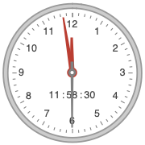

Let us define a function that makes the clock-gauge plot for a given association.

```mathematica
Clear[DoomsdayClockGauge];
Options[DoomsdayClockGauge] = Options[ClockGauge];
DoomsdayClockGauge[m_Integer, s_Integer, opts : OptionsPattern[]] := DoomsdayClockGauge[<|"Minutes" -> m, "Seconds" -> s|>, opts];
DoomsdayClockGauge[a_Association, opts : OptionsPattern[]] :=
  Block[{clockShow},
   clockShow = DatePlus[{0, 0, 0, 12, 0, 0}, {-(Lookup[a, "Minutes", 0]*60 + Lookup[a, "Seconds", 0]), "Seconds"}];
   ClockGauge[clockShow, opts, GaugeLabels -> Placed[Style["Doomsday\nclock", RGBColor[0.7529411764705882, 0.7529411764705882, 0.7529411764705882], FontFamily -> "Krungthep"], Bottom]]
   ];
```

Here are examples:

```mathematica
Row[{
   DoomsdayClockGauge[17, 0], 
   DoomsdayClockGauge[1, 40, GaugeLabels -> Automatic, PlotTheme -> "Scientific"], 
   DoomsdayClockGauge[aDoomReading, PlotTheme -> "Marketing"] 
  }]
```

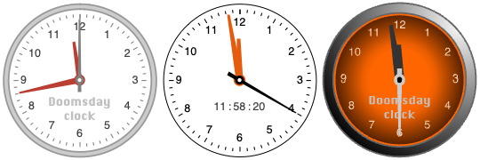

## More robust parsing

More robust parsing of Doomsday Clock statements can be obtained in these three ways:

- “Fuzzy” match of words

    - For misspellings like “doomsdat” instead of “doomsday.”

- Parsing of numeric work forms.

    - For statements, like, “two minutes and twenty five seconds.”

- Delegating the parsing to LLMs when grammar parsing fails.

### Fuzzy matching

The parser ParseFuzzySymbol can be used to handle misspellings (via EditDistance):

```mathematica
pDD = ParseFuzzySymbol["doomsday", 2];
lsPhrases = {"doomsdat", "doomsday", "dumzday"};
ParsingTestTable[pDD, lsPhrases]
```

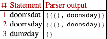

In order to include the misspelling handling into the grammar we manually the grammar. (The grammar is small, so, it is not that hard to do.)

```mathematica
pANY = ParsePredicate[StringQ[#] && EditDistance[#, "clock"] > 1 &];
pOPENING = ParseOption[ParseMany[pANY]]\[CircleTimes]ParseFuzzySymbol["clock", 1]\[CircleTimes]ParseOption[ParseSymbol["is"]]\[CircleTimes]ParseFuzzySymbol["reading", 2];
pMINUTES = "Minutes" -> # &\[CircleDot](pINTEGER \[LeftTriangle] ParseFuzzySymbol["minutes", 3]);
pSECONDS = "Seconds" -> # &\[CircleDot](pINTEGER \[LeftTriangle] ParseFuzzySymbol["seconds", 3]);
pCLOCKREADING = Cases[#, _Rule, \[Infinity]] &\[CircleDot](pOPENING\[CircleTimes](pMINUTES\[CirclePlus]ParseOption[pMINUTES\[CircleTimes]ParseOption[ParseSymbol["and"]\[CirclePlus]ParseSymbol["&"]\[CirclePlus]ParseSymbol[","]]]\[CircleTimes]pSECONDS)\[CircleTimes]ParseSymbol["to"]\[CircleTimes]ParseFuzzySymbol["midnight", 2]);
```

Here is a verification table with correct- and incorrect spellings:

```mathematica
lsPhrases = {
    "doomsday clock is reading 2 seconds to midnight", 
    "dooms day cloc is readding 2 minute and 22 sekonds to mildnight"};
ParsingTestTable[pCLOCKREADING, lsPhrases, "Layout" -> "Vertical"]
```

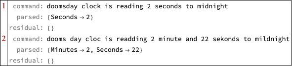

### Parsing of numeric word forms

One way to make the parsing more robust is to implement the ability to parse integer names (or numeric word forms) not just integers.

**Remark:** For a fuller discussion -- and code -- of numeric word forms parsing see the tech note ["Integer names parsing"](https://resources.wolframcloud.com/PacletRepository/resources/AntonAntonov/FunctionalParsers/tutorial/Integernamesparsing.html) of the paclet ["FunctionalParsers"](https://resources.wolframcloud.com/PacletRepository/resources/AntonAntonov/FunctionalParsers/), [AAp1].

First, we make an association that connects integer names with corresponding integer values

```mathematica
aWordedValues = Association[IntegerName[#, "Words"] -> # & /@ Range[0, 100]];
aWordedValues = KeyMap[StringRiffle[StringSplit[#, RegularExpression["\\W"]], " "] &, aWordedValues];
Length[aWordedValues]

(*101*)
```

Here is how the rules look like:

```mathematica
aWordedValues[[1 ;; -1 ;; 20]]

(*<|"zero" -> 0, "twenty" -> 20, "forty" -> 40, "sixty" -> 60, "eighty" -> 80, "one hundred" -> 100|>*)
```

Here we program the integer names parser:

```mathematica
pUpTo10 = ParseChoice @@ Map[ParseSymbol[IntegerName[#, {"English", "Words"}]] &, Range[0, 9]];
p10s = ParseChoice @@ Map[ParseSymbol[IntegerName[#, {"English", "Words"}]] &, Range[10, 100, 10]];
pWordedInteger = ParseApply[aWordedValues[StringRiffle[Flatten@{#}, " "]] &, p10s\[CircleTimes]pUpTo10\[CirclePlus]p10s\[CirclePlus]pUpTo10];
```

Here is a verification table of that parser:

```mathematica
lsPhrases = {"three", "fifty seven", "thirti one"};
ParsingTestTable[pWordedInteger, lsPhrases]
```

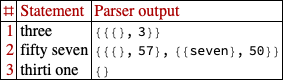

There are two parsing results for “fifty seven”, because pWordedInteger is defined with p10s⊗pUpTo10⊕p10s... . This can be remedied by using ParseJust or ParseShortest:

```mathematica
lsPhrases = {"three", "fifty seven", "thirti one"};
ParsingTestTable[ParseJust@pWordedInteger, lsPhrases]
```

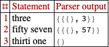

Let us change pINTEGER to parse both integers and integer names:

```mathematica
pINTEGER = (ToExpression\[CircleDot]ParsePredicate[StringMatchQ[#, NumberString] &])\[CirclePlus]pWordedInteger;
lsPhrases = {"12", "3", "three", "forty five"};
ParsingTestTable[pINTEGER, lsPhrases]
```

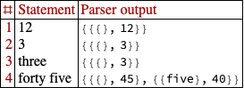

Let us try the new parser using integer names for the clock time:

```mathematica
str = "the doomsday clock is reading two minutes and forty five seconds to midnight";
pTOP[ToTokens@str]

(*{{{}, {"Minutes" -> 2, "Seconds" -> 45}}}*)
```

### Enhance with LLM parsing

There are multiple ways to employ LLMs for extracting “clock readings” from arbitrary statements for Doomsday Clock readings, readouts, and measures. Here we use [LLM few-shot training](https://en.wikipedia.org/wiki/Prompt_engineering#Other_techniques):

```mathematica
flop = LLMExampleFunction[{
    "the doomsday clock is reading two minutes and forty five seconds to midnight" -> "{\"Minutes\":2, \"Seconds\": 45}", 
    "the clock of the doomsday gives 92 seconds to midnight" -> "{\"Minutes\":0, \"Seconds\": 92}", 
    "The bulletin atomic scienist maybe is set to a minute an 3 seconds." -> "{\"Minutes\":1, \"Seconds\": 3}" 
   }, "JSON"]
```

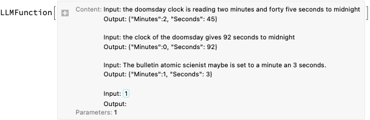


Here is an example invocation:

```mathematica
flop["Maybe the doomsday watch is at 23:58:03"]

(*{"Minutes" -> 1, "Seconds" -> 57}*)
```

The following function combines the parsing with the grammar and the LLM example function -- the latter is used for fallback parsing:

```mathematica
Clear[GetClockReading];
GetClockReading[st_String] := 
   Block[{op}, 
    op = ParseJust[pTOP][ToTokens[st]]; 
    Association@
     If[Length[op] > 0 && op[[1, 1]] === {}, 
      Cases[op, Rule], 
     (*ELSE*) 
      flop[st] 
     ] 
   ];
```

### Robust parser demo

Here is the application of the combine function above over a certain “random” Doomsday Clock statement:

```mathematica
s = "You know, sort of, that dooms-day watch is 1 and half minute be... before the big boom. (Of doom...)";
GetClockReading[s]

(*<|"Minutes" -> 1, "Seconds" -> 30|>*)
```

**Remark:** The same type of robust grammar-and-LLM combination is explained in more detail in the video ["Robust LLM pipelines (Mathematica, Python, Raku)"](https://www.youtube.com/watch?v=QOsVTCQZq_s&t=3700s), [AAv1]. (See, also, the corresponding notebook [AAn1].)

## Timeline

In this section we extract Doomsday Clock timeline data and make a corresponding plot.

### Parsing page data

Instead of using the [official Doomsday clock timeline page](https://thebulletin.org/doomsday-clock/timeline/) we use [Wikipedia](https://en.wikipedia.org/wiki/Doomsday_Clock):

```mathematica
url = "https://en.wikipedia.org/wiki/Doomsday_Clock";
data = Import[url, "Data"];
```

Get timeline table:

```mathematica
tbl = Cases[data, {"Timeline of the Doomsday Clock [ 13 ] ", x__} :> x, Infinity] // First;
```

Show table’s columns:

```mathematica
First[tbl]

(*{"Year", "Minutes to midnight", "Time ( 24-h )", "Change (minutes)", "Reason", "Clock"}*)
```

Make a dataset:

```mathematica
dsTbl = Dataset[Rest[tbl]][All, AssociationThread[{"Year", "MinutesToMidnight", "Time", "Change", "Reason"}, #] &];
dsTbl = dsTbl[All, Append[#, "Date" -> DateObject[{#Year, 7, 1}]] &];
dsTbl[[1 ;; 4]]
```

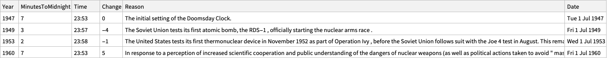

Here is an association used to retrieve the descriptions from the date objects:

```mathematica
aDateToDescr = Normal@dsTbl[Association, #Date -> BreakStringIntoLines[#Reason] &];
```

### Using LLM-extraction instead

Alternatively, we can extract the Doomsday Clock timeline using LLMs. Here we get the plaintext of the Wikipedia page and show statistics:

```mathematica
txtWk = Import[url, "Plaintext"];
TextStats[txtWk]

(*<|"Characters" -> 43623, "Words" -> 6431, "Lines" -> 315|>*)
```

Here we get the Doomsday Clock timeline table from that page in JSON format using an LLM:

```mathematica
res = 
  LLMSynthesize[{
    "Give the time table of the doomsday clock as a time series that is a JSON array.", 
    "Each element of the array is a dictionary with keys 'Year', 'MinutesToMidnight', 'Time', 'Description'.", 
    txtWk, 
    LLMPrompt["NothingElse"]["JSON"] 
   }, 
   LLMEvaluator -> LLMConfiguration[<|"Provider" -> "OpenAI", "Model" -> "gpt-4o", "Temperature" -> 0.4, "MaxTokens" -> 5096|>] 
  ]

(*"```json[{\"Year\": 1947, \"MinutesToMidnight\": 7, \"Time\": \"23:53\", \"Description\": \"The initial setting of the Doomsday Clock.\"},{\"Year\": 1949, \"MinutesToMidnight\": 3, \"Time\": \"23:57\", \"Description\": \"The Soviet Union tests its first atomic bomb, officially starting the nuclear arms race.\"},{\"Year\": 1953, \"MinutesToMidnight\": 2, \"Time\": \"23:58\", \"Description\": \"The United States and the Soviet Union test thermonuclear devices, marking the closest approach to midnight until 2020.\"},{\"Year\": 1960, \"MinutesToMidnight\": 7, \"Time\": \"23:53\", \"Description\": \"Increased scientific cooperation and public understanding of nuclear dangers.\"},{\"Year\": 1963, \"MinutesToMidnight\": 12, \"Time\": \"23:48\", \"Description\": \"The United States and the Soviet Union sign the Partial Test Ban Treaty.\"},{\"Year\": 1968, \"MinutesToMidnight\": 7, \"Time\": \"23:53\", \"Description\": \"Increased tensions due to the Vietnam War, Indo-Pakistani War, and nuclear tests by France and China.\"},{\"Year\": 1969, \"MinutesToMidnight\": 10, \"Time\": \"23:50\", \"Description\": \"Signing of the Nuclear Non-Proliferation Treaty by most nations.\"},{\"Year\": 1972, \"MinutesToMidnight\": 12, \"Time\": \"23:48\", \"Description\": \"The United States and the Soviet Union sign SALT I and the ABM Treaty.\"},{\"Year\": 1974, \"MinutesToMidnight\": 9, \"Time\": \"23:51\", \"Description\": \"India tests a nuclear device, and SALT II talks stall.\"},{\"Year\": 1980, \"MinutesToMidnight\": 7, \"Time\": \"23:53\", \"Description\": \"Stalled American-Soviet talks and the Soviet-Afghan War.\"},{\"Year\": 1981, \"MinutesToMidnight\": 4, \"Time\": \"23:56\", \"Description\": \"Increased tensions due to the Soviet-Afghan War and U.S. nuclear posture.\"},{\"Year\": 1984, \"MinutesToMidnight\": 3, \"Time\": \"23:57\", \"Description\": \"Escalation of tensions between the United States and the Soviet Union.\"},{\"Year\": 1988, \"MinutesToMidnight\": 6, \"Time\": \"23:54\", \"Description\": \"Signing of the Intermediate-Range Nuclear Forces Treaty.\"},{\"Year\": 1990, \"MinutesToMidnight\": 10, \"Time\": \"23:50\", \"Description\": \"The fall of the Berlin Wall and the nearing end of the Cold War.\"},{\"Year\": 1991, \"MinutesToMidnight\": 17, \"Time\": \"23:43\", \"Description\": \"Signing of START I and the end of the East-West nuclear arms race.\"},{\"Year\": 1995, \"MinutesToMidnight\": 14, \"Time\": \"23:46\", \"Description\": \"Concerns about post-Soviet nuclear proliferation.\"},{\"Year\": 1998, \"MinutesToMidnight\": 9, \"Time\": \"23:51\", \"Description\": \"Nuclear tests by India and Pakistan.\"},{\"Year\": 2002, \"MinutesToMidnight\": 7, \"Time\": \"23:53\", \"Description\": \"Little progress on nuclear disarmament and rejection of arms control treaties by the U.S.\"},{\"Year\": 2007, \"MinutesToMidnight\": 5, \"Time\": \"23:55\", \"Description\": \"North Korea tests a nuclear weapon and climate change added as a threat.\"},{\"Year\": 2010, \"MinutesToMidnight\": 6, \"Time\": \"23:54\", \"Description\": \"Cooperation to reduce nuclear arsenals and limit climate change effects.\"},{\"Year\": 2012, \"MinutesToMidnight\": 5, \"Time\": \"23:55\", \"Description\": \"Lack of global action on climate change and nuclear safety.\"},{\"Year\": 2015, \"MinutesToMidnight\": 3, \"Time\": \"23:57\", \"Description\": \"Continued lack of action on climate change and nuclear modernization.\"},{\"Year\": 2017, \"MinutesToMidnight\": 2.5, \"Time\": \"23:57:30\", \"Description\": \"U.S. nuclear policy changes and disbelief in climate science.\"},{\"Year\": 2018, \"MinutesToMidnight\": 2, \"Time\": \"23:58\", \"Description\": \"Failure to address nuclear war and climate change threats.\"},{\"Year\": 2020, \"MinutesToMidnight\": 1.67, \"Time\": \"23:58:20\", \"Description\": \"Increased nuclear tensions and neglect of climate change.\"},{\"Year\": 2023, \"MinutesToMidnight\": 1.5, \"Time\": \"23:58:30\", \"Description\": \"Russian invasion of Ukraine and increased nuclear risks.\"}]```"*)
```

Post process the LLM result:

```mathematica
res2 = ToString[res, CharacterEncoding -> "UTF-8"];
res3 = StringReplace[res2, {"```json", "```"} -> ""];
res4 = ImportString[res3, "JSON"];
res4[[1 ;; 3]]

(*{{"Year" -> 1947, "MinutesToMidnight" -> 7, "Time" -> "23:53", "Description" -> "The initial setting of the Doomsday Clock."}, {"Year" -> 1949, "MinutesToMidnight" -> 3, "Time" -> "23:57", "Description" -> "The Soviet Union tests its first atomic bomb, officially starting the nuclear arms race."}, {"Year" -> 1953, "MinutesToMidnight" -> 2, "Time" -> "23:58", "Description" -> "The United States and the Soviet Union test thermonuclear devices, marking the closest approach to midnight until 2020."}}*)
```

Make a dataset with the additional column “Date” (having date-objects):

```mathematica
dsDoomsdayTimes = Dataset[Association /@ res4];
dsDoomsdayTimes = dsDoomsdayTimes[All, Append[#, "Date" -> DateObject[{#Year, 7, 1}]] &];
dsDoomsdayTimes[[1 ;; 4]]
```

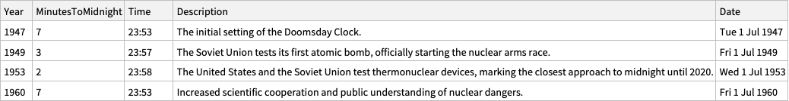

Here is an association that is used to retrieve the descriptions from the date objects:

```mathematica
aDateToDescr2 = Normal@dsDoomsdayTimes[Association, #Date -> #Description &];
```

**Remark:** The LLM derived descriptions above are shorter than the descriptions in the column “Reason” of the dataset obtained parsing the page data. For the plot tooltips below we use the latter.

### Timeline plot

In order to have informative Doomsday Clock evolution plot we obtain and partition dataset’s time series into step-function pairs:

```mathematica
ts0 = Normal@dsDoomsdayTimes[All, {#Date, #MinutesToMidnight} &];
ts2 = Append[Flatten[MapThread[Thread[{#1, #2}] &, {Partition[ts0[[All, 1]], 2, 1], Most@ts0[[All, 2]]}], 1], ts0[[-1]]];
```

Here are corresponding rule wrappers indicating the year and the minutes before midnight:

```mathematica
lbls = Map[Row[{#Year, Spacer[3], "\n", IntegerPart[#MinutesToMidnight], Spacer[2], "m", Spacer[2], Round[FractionalPart[#MinutesToMidnight]*60], Spacer[2], "s"}] &, Normal@dsDoomsdayTimes];
lbls = Map[If[#[[1, -3]] == 0, Row@Take[#[[1]], 6], #] &, lbls];
```

Here the points “known” by the original time series are given callouts:

```mathematica
aRules = Association@MapThread[#1 -> Callout[Tooltip[#1, aDateToDescr[#1[[1]]]], #2] &, {ts0, lbls}];
ts3 = Lookup[aRules, Key[#], #] & /@ ts2;
```

Finally, here is the plot:

```mathematica
DateListPlot[ts3, 
  PlotStyle -> Directive[{Thickness[0.007`], Orange}],
  Epilog -> {PointSize[0.01`], Black, Point[ts0]}, 
  PlotLabel -> Row[(Style[#1, FontSize -> 16, FontColor -> Black, FontFamily -> "Verdana"] &) /@ {"Doomsday clock: minutes to midnight,", Spacer[3], StringRiffle[MinMax[Normal[dsDoomsdayTimes[All, "Year"]]], "-"]}], 
  FrameLabel -> {"Year", "Minutes to midnight"}, 
  Background -> GrayLevel[0.94`], Frame -> True, 
  FrameTicks -> {{Automatic, (If[#1 == 0, {0, Style["00:00", Red]}, {#1, Row[{"23:", 60 - #1}]}] &) /@ Range[0, 17]}, {Automatic, Automatic}}, GridLines -> {None, All},
  AspectRatio -> 1/3, ImageSize -> 1200
]
```

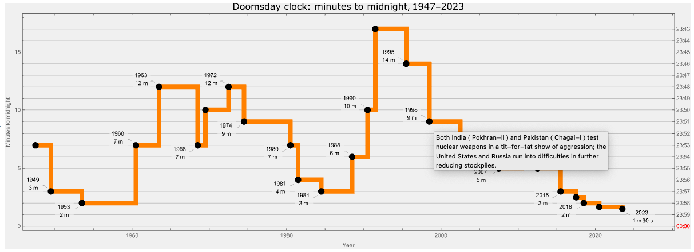

**Remark:** By hovering with the mouse over the black points the corresponding descriptions can be seen. We considered using clock-gauges as tooltips, but showing clock-settings reasons is more informative.

**Remark:** The plot was intentionally made to resemble the [timeline plot in Doomsday Clock's Wikipedia page](https://en.wikipedia.org/wiki/Doomsday_Clock#Timeline).

## Conclusion

As expected, parsing, plotting, or otherwise processing the Doomsday Clock settings and statements are excellent didactic subjects for textual analysis (or parsing) and temporal data visualization. The visualization could serve educational purposes or provide insights into historical trends of global threats as perceived by experts. (Remember, the clock’s settings are not just data points but reflections of complex global dynamics.)

One possible application of the code in this notebook is to make a “web service“ that gives clock images with Doomsday Clock readings. For example, click on this button:

- [**Get Doomsday Clock!**](https://www.wolframcloud.com/obj/e28834c9-42a4-4991-9889-243fa39a795d)

## Setup

```mathematica
Needs["AntonAntonov`FunctionalParsers`"]
```

```mathematica
Clear[TextStats];
TextStats[s_String] := AssociationThread[{"Characters", "Words", "Lines"}, Through[{StringLength, Length@*TextWords, Length@StringSplit[#, "\n"] &}[s]]];
```

```mathematica
BreakStringIntoLines[str_String, maxLength_Integer : 60] := Module[
    {words, lines, currentLine}, 
    words = StringSplit[StringReplace[str, RegularExpression["\\v+"] -> " "]]; 
    lines = {}; 
    currentLine = ""; 
    Do[
       If[StringLength[currentLine] + StringLength[word] + 1 <= maxLength, 
          currentLine = StringJoin[currentLine, If[currentLine === "", "", " "], word], 
          AppendTo[lines, currentLine]; 
          currentLine = word; 
        ], 
       {word, words} 
     ]; 
    AppendTo[lines, currentLine]; 
    StringJoin[Riffle[lines, "\n"]] 
  ]
```

## References

### Articles, notebooks

[AAn1] Anton Antonov, ["Making robust LLM computational pipelines from software engineering perspective"](https://community.wolfram.com/groups/-/m/t/3279791), (2024), [Wolfram Community](https://community.wolfram.com).

### Paclets

[AAp1] Anton Antonov, ["FunctionalParsers"](https://resources.wolframcloud.com/PacletRepository/resources/AntonAntonov/FunctionalParsers/), (2023), [Wolfram Language Paclet Repository](https://resources.wolframcloud.com/PacletRepository/).

### Videos

[AAv1] Anton Antonov, ["Robust LLM pipelines (Mathematica, Python, Raku)"](https://youtu.be/QOsVTCQZq_s), (2024), [YouTube/@AAA4prediction](https://www.youtube.com/@AAA4prediction).
