# Maze Making Using Graphs

Anton Antonov   
[RakuForPrediction at WordPress](https://rakuforprediction.wordpress.com)    
[MathematicaForPrediction at WordPress](https://mathematicaforprediction.wordpress.com)   
December 2025

---

## Introduction

This notebook describes three ways of making mazes (or labyrinths) using graphs. The first two are based on rectangular grids; the third on a hexagonal grid.

All computational graph features discussed here are provided by the [Graph functionalities](http://reference.wolfram.com/language/guide/GraphsAndNetworks.html).

### TL;DR

Just see the maze pictures below. (And try to solve the mazes.)

### Procedure outline

The **first maze** is made by a simple procedure which is actually some sort of cheating:

- A regular rectangular grid graph is generated with random weights associated with its edges.

- The (minimum) spanning tree for that graph is found.

- That tree is plotted with exaggeratedly large vertices and edges, so the graph plot looks like a maze.

    - This is "the cheat" --- the maze walls are not given by the graph.

The **second maze** is made "properly":

- Two interlacing regular rectangular grid graphs are created.

- The second one has one less row and one less column than the first.

- The vertex coordinates of the second graph are at the centers of the rectangles of the first graph.

- The first graph provides the maze walls; the second graph is used to make paths through the maze.

    - In other words, to create a solvable maze.

- Again, random weights are assigned to edges of the second graph, and a minimum spanning tree is found.

- There is a convenient formula that allows using the spanning tree edges to remove edges from the first graph.

- In that way, a proper maze is derived.

The **third maze** is again made "properly" using the procedure above with two modifications:

- Two interlacing regular grid graphs are created: one over a hexagonal grid, the other over a triangular grid.

    - The hexagonal grid graph provides the maze walls; the triangular grid graph provides the maze paths.

- Since the formula for wall removal is hard to derive, a more robust and universal method based on nearest neighbors is used.

---

## Simple Maze

In this section, we create a simple, "cheating" maze.

**Remark:** The steps are easy to follow, given the procedure outlined in the introduction.

```wl
RandomSeed[3021];
 {n, m} = {10, 25};
 g = GridGraph[{n, m}];
 gWeighted = Graph[VertexList[g], UndirectedEdge @@@ EdgeList[g], EdgeWeight -> RandomReal[{10, 1000}, EdgeCount[g]]];
 Information[gWeighted]
```

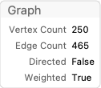

Find the spanning tree of the graph:

```wl
mazeTree = FindSpanningTree[gWeighted];
```

Shortest path from the first vertex (bottom-left) to the last vertex (top-right):

```wl
path = FindShortestPath[mazeTree, 1, n*m];
 Length[path]
```

```wl
Out[]= 46
```

Graph plot:

```wl
simpleMaze = Graph[VertexList[mazeTree], EdgeList[mazeTree], VertexCoordinates -> GraphEmbedding[g]];
 simpleMaze2 = EdgeAdd[simpleMaze, {"start" -> 1, Max[VertexList[simpleMaze]] -> "end"}];
 Clear[vf1, ef1];
 vf1[col_?ColorQ][{xc_, yc_}, name_, {w_, h_}] := {col, EdgeForm[None],Rectangle[{xc - w, yc - h}, {xc + w, yc + h}]};
 ef1[col_?ColorQ][pts_List, e_] := {col, Opacity[1], AbsoluteThickness[22], Line[pts]};
 grCheat = GraphPlot[simpleMaze2, VertexSize -> 0.8, VertexShapeFunction -> vf1[White], EdgeShapeFunction -> ef1[White], Background -> DarkBlue, ImageSize -> 800, ImagePadding -> 0];
 range = MinMax /@ Transpose[Flatten[List @@@ Cases[grCheat, _Rectangle, \[Infinity]][[All, All]], 1]];
 Show[grCheat, PlotRange -> range]
```

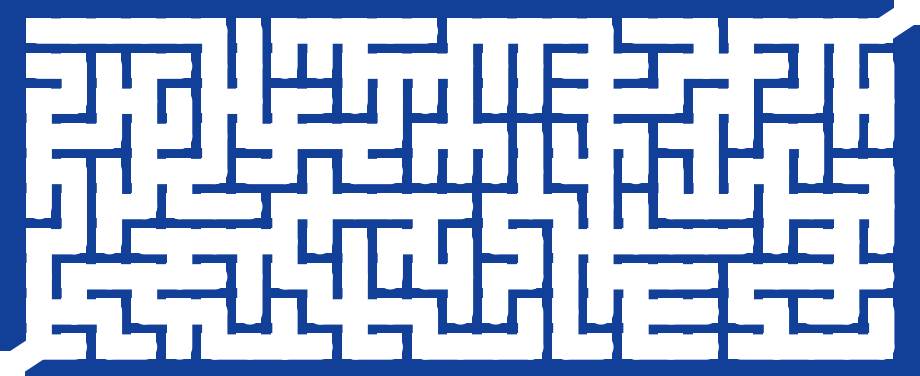

The "maze" above looks like a maze because the vertices and edges are rectangular with matching sizes, and they are thicker than the spaces between them. In other words, we are cheating.

To make that cheating construction clearer, let us plot the shortest path from the bottom left to the top right and color the edges in pink (salmon) and the vertices in red:

```wl
gPath = PathGraph[path, VertexCoordinates -> GraphEmbedding[g][[path]]];
 Legended[
   Show[
    grCheat, 
    Graph[gPath, VertexSize -> 0.7, VertexShapeFunction -> vf1[Red], EdgeShapeFunction -> ef1[Pink], Background -> DarkBlue, ImageSize -> 800, ImagePadding -> 0], 
    PlotRange -> range 
   ], 
   SwatchLegend[{Red, Pink, DarkBlue}, {"Shortest path vertices", "Shortest path edges", "Image background"}]]
```

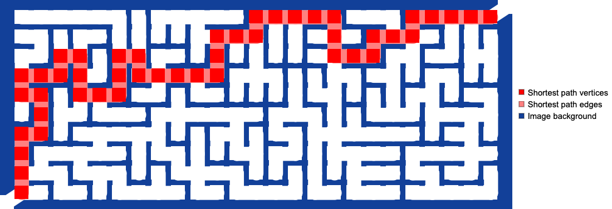

----

## Proper Maze

A ***proper maze*** is a maze given with its walls (not with the space between walls).

**Remark:** For didactical reasons, the maze in this section is small so that the steps---outlined in the introduction---can be easily followed.

Make two regular graphs: one for the maze walls and the other for the maze paths.

```wl
{n, m} = {6, 12};
 g1 = GridGraph[{n, m}, VertexLabels -> "Name"];
 g1 = VertexReplace[g1, Thread[VertexList[g1] -> Map[w @@ QuotientRemainder[# - 1, n] &, VertexList[g1]]]];
 g2 = GridGraph[{n - 1, m - 1}];
 g2 = VertexReplace[g2, Thread[VertexList[g2] -> Map[QuotientRemainder[# - 1, n - 1] &, VertexList[g2]]]];
 g2 = Graph[g2, VertexLabels -> "Name", VertexCoordinates -> Map[# + {1, 1}/2 &, GraphEmbedding[g2]]];
 Grid[{{"Wall graph", "Paths graph"}, {Information[g1], Information[g2]}}]
```

|  |  |
| - | - |
| Wall graph | Paths graph |
| -InformationData- | -InformationData- |

See how the graph "interlace":

```wl
(*Show[g1,HighlightGraph[g2,g2],ImageSize->800]*)
```

Maze Path Graph:

```wl
mazePath = Graph[EdgeList[g2], EdgeWeight -> RandomReal[{10, 10000}, EdgeCount[g2]]];
 mazePath = FindSpanningTree[mazePath, VertexCoordinates -> Thread[VertexList[g2] -> GraphEmbedding[g2]]];
 Information[mazePath]
```

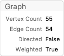

Combined Graph:

```wl
g3 = Graph[
     Join[EdgeList[g1], EdgeList[mazePath]], VertexCoordinates -> Join[Thread[VertexList[g1] -> GraphEmbedding[g1]], Thread[VertexList[mazePath] -> GraphEmbedding[mazePath]]], 
     VertexLabels -> "Name"];
 Information[g3]
```


Plot the combined graph:

```wl
HighlightGraph[g3, mazePath, ImageSize -> 800]
```

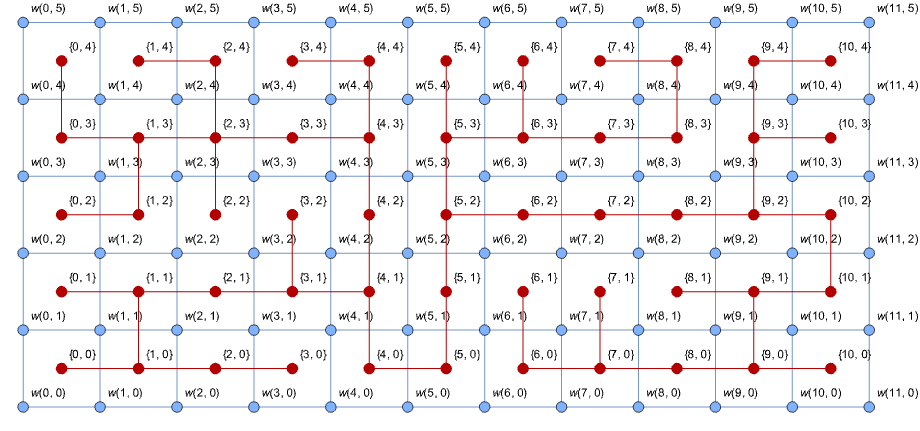

Remove wall edges using a formula:

```wl
g4 = Graph[g3, VertexLabels -> None]; 
  
 Do[{i, j} = e[[1]]; 
      {i2, j2} = e[[2]]; 
      If[i2 < i || j2 < j, {{i2, j2}, {i, j}} = {{i, j}, {i2, j2}}]; 
      
     (*Horizontal*) 
      If[i == i2 && j < j2, 
       g4 = EdgeDelete[g4, UndirectedEdge[w[i2, j2], w[i2 + 1, j2]]] 
      ]; 
      
     (*Vertical*) 
      If[j == j2 && i < i2, 
       g4 = EdgeDelete[g4, UndirectedEdge[w[i2, j2], w[i2, j2 + 1]]] 
      ]; 
     , {e, EdgeList[mazePath]}]; 
  
 Information[g4]
```

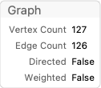

Plot wall graph and maze paths (maze space) graph:

```wl
HighlightGraph[g4, mazePath, ImageSize -> 800]
```

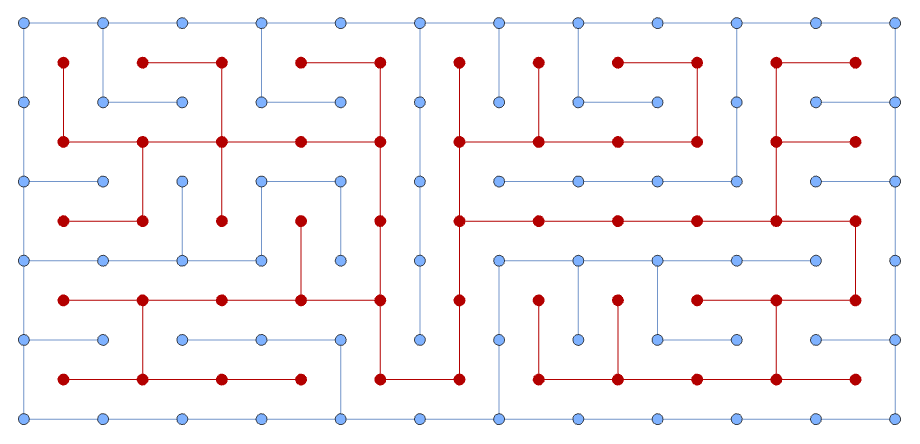

Fancier maze presentation with rectangular vertices and edges (with matching sizes):

```wl
g5 = Subgraph[g4, VertexList[g1]];
 g5 = VertexDelete[g5, {w[0, 0], w[m - 1, n - 1]}];
 g6 = Graph[g5, VertexShapeFunction -> None, EdgeShapeFunction -> ({Opacity[1], DarkBlue, AbsoluteThickness[30], Line[#1]} &), ImageSize -> 800]
```


Here is how a solution can found and plotted:

```wl
(*solution=FindPath[#,VertexList[#][[1]],VertexList[#][[-1]]]&@mazePath;
 Show[g6,HighlightGraph[Subgraph[mazePath,solution],Subgraph[mazePath,solution]]]*)
```

Here is a (more challenging to solve) maze generated with $n=12$ and $m=40$:

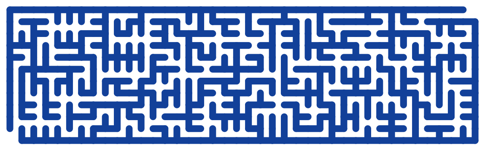

----

## Hexagonal Version

Let us create another maze based on a hexagonal grid. Here are two grid graphs:

- The first is a **hexagonal grid** graph representing the maze's walls.

- The second graph is a **triangular grid** graph with one fewer row and column, and shifted vertex coordinates.

```wl
{n, m} = {6, 14}*2; 
g1 = ResourceFunction["HexagonalGridGraph"][{m, n}]; 
g1 = VertexReplace[g1, Thread[VertexList[g1] -> (w[#1] & ) /@ VertexList[g1]]]; 
g2 = ResourceFunction["https://www.wolframcloud.com/obj/antononcube/DeployedResources/Function/TriangularLatticeGraph/"][{n - 1, m - 1}]; 
g2 = Graph[g2, VertexCoordinates -> (#1 + {Sqrt[3], 1} & ) /@ GraphEmbedding[g2]]; 
{Information[g1], Information[g2]}
```

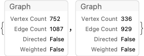

```wl
Show[g1, HighlightGraph[g2, g2], ImageSize -> 800]
```


Maze Path Graph:

```wl
mazePath = Graph[EdgeList[g2], EdgeWeight -> RandomReal[{10, 10000}, EdgeCount[g2]]];
 mazePath = FindSpanningTree[mazePath, VertexCoordinates -> Thread[VertexList[g2] -> GraphEmbedding[g2]]];
 Information[mazePath]
```

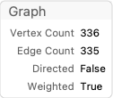

Combine the walls-maze and the maze-path graphs (i.e., make a union of them), and plot the resulting graph:

```wl
g3 = GraphUnion[g1, mazePath, VertexCoordinates -> Join[Thread[VertexList[g1] -> GraphEmbedding[g1]], Thread[VertexList[mazePath] -> GraphEmbedding[mazePath]]]];
 Information[g3]
```

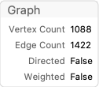

```wl
HighlightGraph[g3, mazePath, ImageSize -> 800]
```

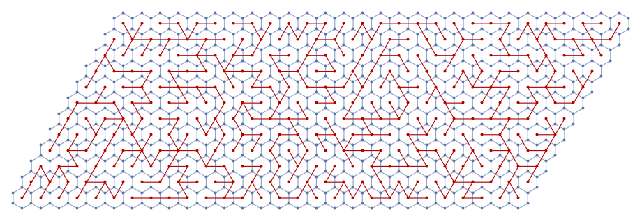

Make a nearest neighbor points finder functor:

```wl
finder = Nearest[Thread[GraphEmbedding[g1] -> VertexList[g1]]]
```

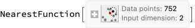

Take a maze edge and its vertex points:

```wl
e = First@EdgeList[mazePath];
 aMazePathCoords = Association@Thread[VertexList[mazePath] -> GraphEmbedding[mazePath]];
 points = List @@ (e /. aMazePathCoords)
```

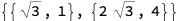

Find the edge's midpoint and the nearest wall-graph vertices:

```wl
Print["Middle edge point: ", Mean[points]]
Print["Edge to remove: ", UndirectedEdge @@ finder[Mean[points]]]
```

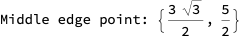

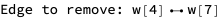

Loop over all maze edges, removing wall-maze edges:

```wl
g4 = g1;
 Do[
    points = Map[aMazePathCoords[#] &, List @@ e]; 
     m = Mean[points]; 
     vs = finder[m]; 
     g4 = EdgeDelete[g4, UndirectedEdge @@ vs]; 
    , {e, EdgeList[mazePath]}] 
  
 Information[g4]
```

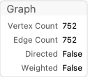

Here is the obtained graph

```wl
Show[g4, ImageSize -> 800]
```

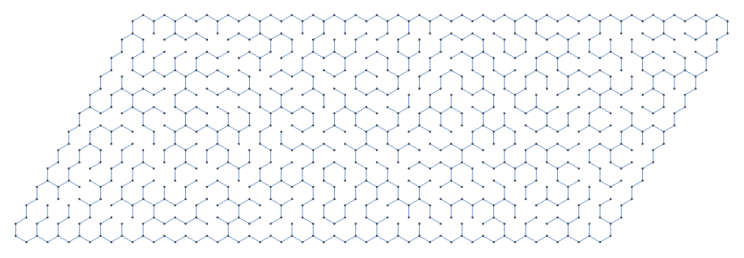

The start and end points of the maze:

```wl
aVertexCoordinates = Association@Thread[VertexList[g4] -> GraphEmbedding[g4]];
 {start, end} = Keys[Sort[aVertexCoordinates]][[{1, -1}]]
```

```wl
Out[]= {w[1], w[752]}
```

Finding the Maze Solution:

```wl
Out[]= Sequence[1, 240]
```

```wl
solution = FindShortestPath[mazePath, Sequence @@ Keys[Sort[aMazePathCoords]][[{1, -1}]]];
 solution = PathGraph[solution, VertexCoordinates -> Lookup[aMazePathCoords, solution]];
```

Plot the maze:

```wl
g5 = Graph[g4, VertexShapeFunction -> None, EdgeShapeFunction -> ({Opacity[1], DarkBlue, AbsoluteThickness[8], Line[#1]} &), ImageSize -> 800];
 g5 = VertexDelete[g5, {start, end}]
```

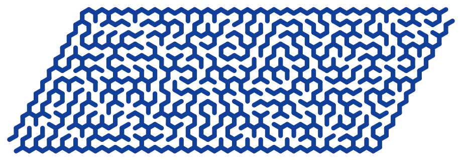

Here is [the solution of the maze](./Diagrams/Maze-making-using-graphs/099kgbigxiuac.png):

```wl
Show[g5, HighlightGraph[solution, solution]]
```

----


## Additional Comments

- The notebook can be used to compare the graph functionalities of Wolfram Language with those of Raku.

    - See the Raku Advent Calendar post ["Day 24 -- Maze Making Using Graphs"](https://raku-advent.blog/2025/12/24/day-24-maze-making-using-graphs/), [AA1].

- Here are the special graph functionalities used to create the mazes:

    - Construction of [regular grid graphs](https://mathworld.wolfram.com/GridGraph.html)

    - Construction of [hexagonal grid graphs](https://mathworld.wolfram.com/HexagonalGridGraph.html)

    - Construction of [triangular grid graphs](https://mathworld.wolfram.com/TriangularGridGraph.html)

    - [Subgraph](https://mathworld.wolfram.com/Subgraph.html) extraction

    - [Neighborhood graphs](https://mathworld.wolfram.com/NeighborhoodGraph.html)

    - [Graph difference](https://mathworld.wolfram.com/GraphDifference.html)

    - Edge deletion

    - Graph highlighting

- The edge removal  can be done with RegionDisjoint instead of using Nearest.

    - And that approach would be more robust if graphs with irregular embedding are used. 

----

## References

### Articles, Blog Posts

[AA1] Anton Antonov, ["Day 24 -- Maze Making Using Graphs"](https://raku-advent.blog/2025/12/24/day-24-maze-making-using-graphs/), (2025), [Raku Advent Calendar at WordPress](https://raku-advent.blog/) .

### Functions

[AAf1] Anton Antonov, [TriangularLatticeGraph](https://www.wolframcloud.com/obj/antononcube/DeployedResources/Function/TriangularLatticeGraph/), (2025), [Wolfram Function Repository](https://resources.wolframcloud.com/FunctionRepository/).

[EWf1] Eric Weisstein, [TriangularGridGraph](https://resources.wolframcloud.com/FunctionRepository/resources/TriangularGridGraph/), (2020), [Wolfram Function Repository](https://resources.wolframcloud.com/FunctionRepository/).

[WRIf1] Wolfram Research, [HexagonalGridGraph](https://resources.wolframcloud.com/FunctionRepository/resources/HexagonalGridGraph/), (2020), [Wolfram Function Repository](https://resources.wolframcloud.com/FunctionRepository/).

### Packages

[AAp1] Anton Antonov, [Graph, Raku package](https://github.com/antononcube/Raku-Graph) , (2024--2025), [GitHub/antononcube](https://github.com/antononcube) .

[AAp2] Anton Antonov, [Math::Nearest, Raku package](https://github.com/antononcube/Raku-Math-Nearest) , (2024), [GitHub/antononcube](https://github.com/antononcube) .