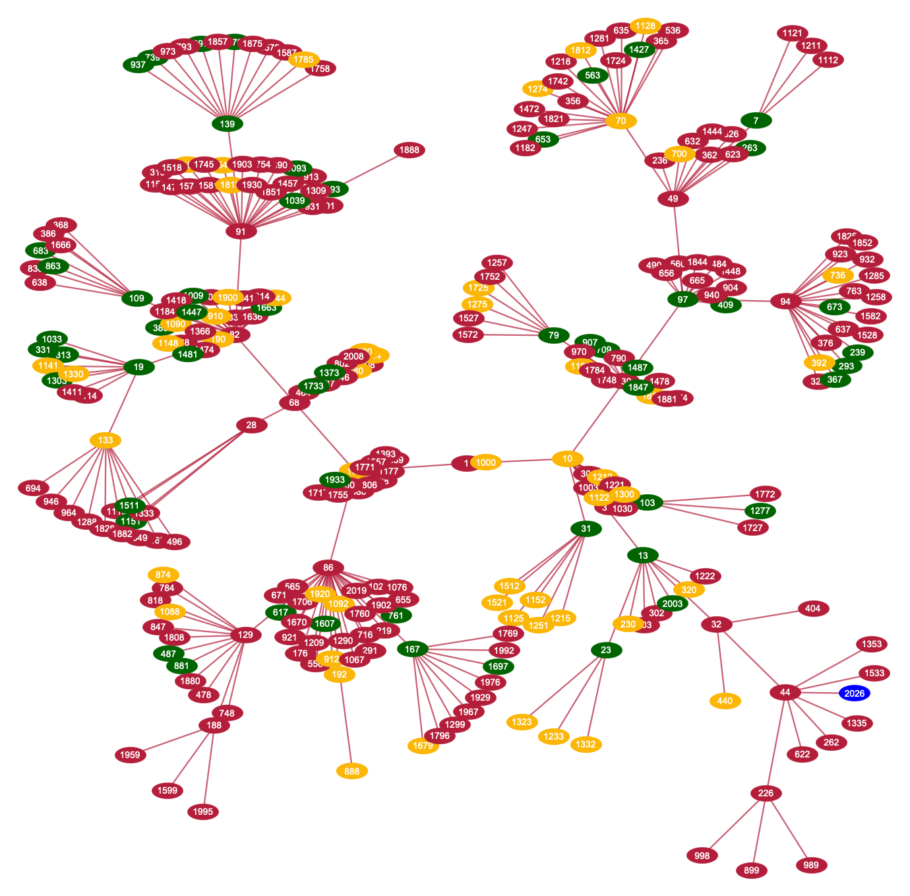
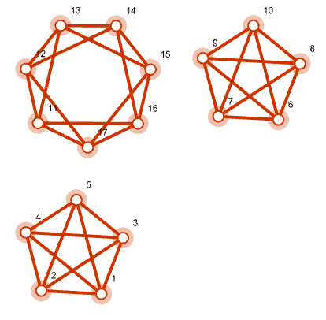

# Numerically 2026 Is Unremarkable Yet Happy

... and has primitive roots

Anton Antonov
[MathematicaForPrediction at WordPress](https://mathematicaforprediction.wordpress.com)
December 2025

### Introduction

This document discusses number theory properties and relationships of the integer 2026.

The integer $2026$ is semiprime and a happy number, with $365$ as one of its primitive roots. Although $2026$ may not be particularly noteworthy in number theory, this provides a great excuse to create various elaborate visualizations that reveal some interesting aspects of the number.

### Setup

```wl
(*PacletInstall[AntonAntonov/NumberTheoryUtilities]*)
   Needs["AntonAntonov`NumberTheoryUtilities`"]
```

### 2026 Is a Happy Semiprime with Primitive Roots

First, $2026$ is obviously not prime---it is divisible by 2 ---but dividing it by 2 gives a prime, $1013$ :

```wl
PrimeQ[2026/2]
```

```wl
Out[]= True
```

Hence, 2026 is a **[semiprime](https://en.wikipedia.org/wiki/Semiprime)** . The integer 1013 is not a [Gaussian prime](https://en.wikipedia.org/wiki/Gaussian_integer#Gaussian_primes) , though:

```wl
PrimeQ[1013, GaussianIntegers -> True]
```

```wl
Out[]= False
```

A **[happy number](https://en.wikipedia.org/wiki/Happy_number)** is a number for which iteratively summing the squares of its digits eventually reaches 1 (e.g., 13 -> 10 -> 1). Here is a check that 2026 is happy:

```wl
ResourceFunction["HappyNumberQ"][2026]
```

```wl
Out[]= True
```

Here is the corresponding trail of digit-square sums:

```wl
FixedPointList[Total[IntegerDigits[#]^2] &, 2026]
```

```wl
Out[]= {2026, 44, 32, 13, 10, 1, 1}
```

Not many years in this century are happy numbers:

```wl
Pick[Range[2000, 2100], ResourceFunction["HappyNumberQ"] /@ Range[2000, 2100]]
```

```wl
Out[]= {2003, 2008, 2019, 2026, 2030, 2036, 2039, 2062, 2063, 2080, 2091, 2093}
```

The decomposition of $2026$ as  $2 * 1013$ means the multiplicative group modulo $2026$ has primitive roots. A primitive root exists for an integer $n$ if and only if $n$ is $1$, $2$,$4$, $p^k$ , or $2 p^k$ , where $k$ is an odd prime and $k>0$ .

We can check additional facts about 2026, such as whether it is ["square-free"](https://mathworld.wolfram.com/Squarefree.html) , among other properties. However, let us compare these with the [feature-rich 2025](https://rakuforprediction.wordpress.com/2025/01/03/numeric-properties-of-2025/) in the next section.

### Comparison with 2025

Here is a side-by-side comparison of key number theory properties for $2025$ and $2026$ .

```wl
ds = Dataset[{<|"Property" -> "Prime or Composite", "2025" -> "Composite", "2026" -> "Composite", "Notes" -> "Both non-prime."|>, <|"Property" -> "Prime Factorization", "2025" -> "3^4 * 5^2 (81 * 25)", "2026" -> "2 * 1013", "Notes" -> "2025 has repeated small primes; 2026 is a semiprime (product of two distinct primes)."|>, <|"Property" -> "Number of Divisors", "2025" -> "15 (highly composite for its size)", "2026" -> "4 (1, 2, 1013, 2026)", "Notes" -> "2025 has many divisors; 2026 has very few."|>, <|"Property" -> "Perfect Square", "2025" -> "Yes (45^2 = 2025)", "2026" -> "No", "Notes" -> "Major highlight for 2025---rare square year."|>, <|"Property" -> "Sum of Cubes", "2025" -> "Yes (1^3 + 2^3 + ... + 9^3 = (1 + ... + 9)^2 = 2025)","2026" -> "No", "Notes" -> "Iconic property for 2025 (Nicomachus's theorem)."|>, <|"Property" -> "Happy Number", "2025" -> "No (process leads to cycle including 4)", "2026" -> "Yes (repeated squared digit sums reach 1)", "Notes" -> "Key point for 2026---its main \"happy\" trait."|>, <|"Property" -> "Harshad Number", "2025" -> "Yes (divisible by 9)","2026" -> "No (not divisible by 10)", "Notes" -> "2025 qualifies; 2026 does not."|>, <|"Property" -> "Primitive Roots", "2025" -> "No", "2026" -> "Yes","Notes" -> "This is a relatively rare property to have."|>, <|"Property" -> "Other Notable Traits", "2025" -> {"(20 + 25)^2 = 2025", "Sum of first 45 odd numbers", "Deficient number", "Many pattern-based representations"}, "2026" -> {"Even number", "Deficient number", "Few special patterns"}, "Notes" -> "2025 is packed with elegant properties; 2026 is more \"plain\" beyond being happy."|>, <|"Property" -> "Overall \"Interest\" Level", "2025" -> "Highly interesting---celebrated in math communities for squares, cubes, and patterns", "2026" -> "Relatively uninteresting---basic semiprime with no standout geometric or sum properties", "Notes" -> "Reinforces blog's angle."|>}];
 ds = ds[All, # /. {x_String :> Style[x, FontFamily -> "Times New Roman"]} &];
 ds = ds[All, Prepend[#, #Property -> Style[#Property, Bold]] &];
 ResourceFunction["GridTableForm"][ds]
```

|  |  |  |  |
| - | - | - | - |
| Property | 2025 | 2026 | Notes |
| Prime or Composite | Composite | Composite | Both non-prime. |
| Prime Factorization | 3^4 * 5^2 (81 * 25) | 2 * 1013 | 2025 has repeated small primes; 2026 is a semiprime (product of two distinct primes). |
| Number of Divisors | 15 (highly composite for its size) | 4 (1, 2, 1013, 2026) | 2025 has many divisors; 2026 has very few. |
| Perfect Square | Yes (45^2 = 2025) | No | Major highlight for 2025---rare square year. |
| Sum of Cubes | Yes (1^3 + 2^3 + ... + 9^3 = (1 + ... + 9)^2 = 2025) | No | Iconic property for 2025 (Nicomachus's theorem). |
| Happy Number | No (process leads to cycle including 4) | Yes (repeated squared digit sums reach 1) | Key point for 2026---its main "happy" trait. |
| Harshad Number | Yes (divisible by 9) | No (not divisible by 10) | 2025 qualifies; 2026 does not. |
| Primitive Roots | No | Yes | This is a relatively rare property to have. |
| Other Notable Traits | {(20 + 25)^2 = 2025, Sum of first 45 odd numbers, Deficient number, Many pattern-based representations} | {Even number, Deficient number, Few special patterns} | 2025 is packed with elegant properties; 2026 is more "plain" beyond being happy. |
| Overall "Interest" Level | Highly interesting---celebrated in math communities for squares, cubes, and patterns | Relatively uninteresting---basic semiprime with no standout geometric or sum properties | Reinforces blog's angle. |

To summarize:

- **2025** stands out as a mathematically rich number, often highlighted in puzzles and articles for its perfect square status and connections to sums of cubes and odd numbers.

- **2026** , in contrast, has fewer flashy properties -- it's a straightforward even semiprime -- but it qualifies as a *happy number* and it has a primitive root.

Here is a computationally generated comparison table of most of the properties found in the table above:

```wl
Dataset@Map[<|"Function" -> #1, "2025" -> #1[2025], "2026" -> #1[2026]|> &, {PrimeQ, CompositeQ, Length@*Divisors, PrimeOmega, EulerPhi, SquareFreeQ, ResourceFunction["HappyNumberQ"],ResourceFunction["HarshadNumberQ"], ResourceFunction["DeficientNumberQ"], PrimitiveRoot}]
```

| Function | 2025 | 2026 |
| - | - | - |
| PrimeQ | False | False |
| CompositeQ | True | True |
| -Composition- | 15 | 4 |
| PrimeOmega | 6 | 2 |
| EulerPhi | 1080 | 1012 |
| SquareFreeQ | False | True |
| -ResourceFunction- | False | True |
| -ResourceFunction- | True | False |
| -ResourceFunction- | True | True |
| PrimitiveRoot | -PrimitiveRoot- | 3 |

### Phi Number System

Digits of 2026 represented in the [Phi number system](https://mathworld.wolfram.com/PhiNumberSystem.html) :

```wl
ResourceFunction["PhiNumberSystem"][2026]
```

```wl
Out[]= {15, 13, 10, 6, -6, -11, -16}
```

Verification:

```wl
Total[GoldenRatio^%] // RootReduce
```

```wl
Out[]= 2026
```

### Happy Numbers Trail Graph

Let us create and plot a graph showing the trails of all happy numbers less than or equal to 2026. Below, we identify these numbers and their corresponding trails:

```wl
ns = Range[2, 2026];
 AbsoluteTiming[
   trails = Map[FixedPointList[Total[IntegerDigits[#]^2] &, #, 100, SameTest -> (Abs[#1 - #2] < 1*^-10 &)] &, ns]; 
  ]
```

```wl
Out[]= {0.293302, Null}
```

Here is the corresponding trails graph, highlighting the primes and happy numbers:

```wl
happy = First /@ Select[trails, #[[-1]] == 1 &];
 primeToo = Select[happy, PrimeQ];
 joyfulToo = Select[happy, ResourceFunction["HarshadNumberQ"]];
 aColors = Flatten@{Thread[primeToo -> ResourceFunction["HexToColor"]["#006400"]],2026 -> Blue, Thread[joyfulToo -> ResourceFunction["HexToColor"]["#fbb606ff"]], _ -> ResourceFunction["HexToColor"]["#B41E3A"]};
 edges = DeleteDuplicates@Flatten@Map[Rule @@@ Partition[Most[#], 2, 1] &, Select[trails, #[[-1]] == 1 &]];
 vf1[{xc_, yc_}, name_, {w_, h_}] := {(name /. aColors), EdgeForm[name /. aColors], Rectangle[{xc - 2 w, yc - h}, {xc + 2 w, yc + h}], Text[Style[name, 12, White], {xc, yc}]}
 vf2[{xc_, yc_}, name_, {w_, h_}] := {(name /. aColors), EdgeForm[name /. aColors], Disk[{xc, yc}, {2 w, h}], Text[Style[name, 12, White], {xc, yc}]} 
  
 gTrails = 
   Graph[
    edges, 
    VertexStyle -> ResourceFunction["HexToColor"]["#B41E3A"], VertexSize -> 1.8, 
    VertexShapeFunction -> vf2, 
    EdgeStyle -> Directive[ResourceFunction["HexToColor"]["#B41E3A"]], 
    EdgeShapeFunction -> ({ResourceFunction["HexToColor"]["#B41E3A"], Thick, BezierCurve[#1]} &), 
    DirectedEdges -> False, 
    GraphLayout -> "SpringEmbedding", 
    ImageSize -> 1200]
```



### Triangular Numbers

There is a theorem by Gauss stating that any integer can be represented as a sum of at most three triangular numbers. Here we find an "interesting" solution:

```wl
sol = FindInstance[{2026 == PolygonalNumber[i] + PolygonalNumber[j] + PolygonalNumber[k], i > 10, j > 10, k > 10}, {i, j, k}, Integers]
```

```wl
Out[]= {{i -> 11, j -> 19, k -> 59}}
```

Here, we verify the result:

```wl
Total[PolygonalNumber /@ sol[[1, All, 2]]]
```

```wl
Out[]= 2026
```

### Chord Diagrams

Here is the number of primitive roots of the [multiplication group modulo](https://mathworld.wolfram.com/ModuloMultiplicationGroup.html) 2026:

```wl
PrimitiveRootList[2026] // Length
```

```wl
Out[]= 440
```

Here are chord plots [AA2, AAp1, AAp2, AAv1] corresponding to a few selected primitive roots:

```wl
Row@Map[Labeled[ChordTrailsPlot[2026, #, PlotStyle -> {AbsoluteThickness[0.01]}, ImageSize -> 400], #] &, {339, 365, 1529}]
```


**Remark:** It is interesting that 365 (the number of days in a common calendar year) is a primitive root of the multiplicative group generated by 2026 . Not many years have this property this century; many do not have primitive roots at all.

```wl
Pick[Range[2000, 2100], Map[MemberQ[PrimitiveRootList[#], 365] &, Range[2000, 2100]]]
```

```wl
Out[]= {2003, 2026, 2039, 2053, 2063, 2078, 2089}
```

### [Quartic Graphs](https://mathworld.wolfram.com/QuarticGraph.html)

The number 2026 appears in [18 results of the search "2026 graphs"](https://oeis.org/search?q=2026&fmt=data) in [«The On-line Encyclopedia of Integer Sequences»](https://oeis.org/) . Here is the first result (from 2025-12-17): [A033483](https://oeis.org/A033483) , "Number of disconnected 4-valent (or quartic) graphs with n nodes." Below, we retrieve properties from A033483's page:

```wl
ResourceFunction["OEISSequenceData"]["A033483", "Dataset"][{"IDNumber","IDString", "Name", "Sequence", "Offset"}]
```

| IDNumber | IDString | Name | Sequence | Offset |
| - | - | - | - | - |
| 33483 | A033483 | Number of disconnected 4-valent (or quartic) graphs with n nodes. | {0, 0, 0, 0, 0, 0, 0, 0, 0, 0, 1, 1, 3, 8, 25, 88, 378, 2026, 13351, 104595, 930586, 9124662, 96699987, 1095469608, 13175272208, 167460699184, 2241578965849, 31510542635443, 464047929509794, 7143991172244290, 114749135506381940, 1919658575933845129, 33393712487076999918, 603152722419661386031} | 0 |

Here, we just get the title:

```wl
ResourceFunction["OEISSequenceData"]["A033483", "Name"]
```

```wl
Out[]= "Number of disconnected 4-valent (or quartic) graphs with n nodes."
```

Here, we get the corresponding sequence:

```wl
seq = ResourceFunction["OEISSequenceData"]["A033483", "Sequence"]
```

```wl
Out[]= {0, 0, 0, 0, 0, 0, 0, 0, 0, 0, 1, 1, 3, 8, 25, 88, 378, 2026, 13351, 104595, 930586, 9124662, 96699987, 1095469608, 13175272208, 167460699184, 2241578965849, 31510542635443, 464047929509794, 7143991172244290, 114749135506381940, 1919658575933845129, 33393712487076999918, 603152722419661386031}
```

Here we find the position of 2026 in that sequence:

```wl
Position[seq, 2026]
```

```wl
Out[]= {{18}}
```

Given the title of the sequence and the extracted position of $2026$ , this means that the number of disconnected [4-regular graphs](https://mathworld.wolfram.com/QuarticGraph.html) with 17 vertices is $2026$. ($17$ because the sequence offset is $0$.) Let us create a few graphs from that set by using the [5-vertex complete graph ](https://mathworld.wolfram.com/CompleteGraph.html)$\left(K_5\right.$[)](https://mathworld.wolfram.com/CompleteGraph.html) and [circulant graphs]() . Here is an example of such a graph:

```wl
g1 = Fold[GraphUnion, CompleteGraph[5], {IndexGraph[CompleteGraph[5], 6], IndexGraph[CirculantGraph[7, {1, 2}], 11]}];
GraphPlot[g1, VertexLabels -> "Name", PlotTheme -> "Web", ImagePadding -> 10]
```


And here is another one:

```wl
g2 = GraphUnion[CirculantGraph[12, {1, 5}], IndexGraph[CompleteGraph[5], 13]];
GraphPlot[g1, VertexLabels -> "Name", PlotTheme -> "Web", ImagePadding -> 10]
```



Here, we check that all vertices have degree 4:

```wl
Mean@VertexDegree[g2]
```

```wl
Out[]= 4
```

**Remark:** Note that although the plots show disjoint graphs, each graph plot represents a single graph object.

### Additional Comments

This section has a few additional (leftover) comments.

- After I researched and published the blog post ["Numeric properties of 2025"](https://rakuforprediction.wordpress.com/2025/01/03/numeric-properties-of-2025/) , [AA1], in the first few days of 2025, I decided to program additional [Number theory functionalities for Raku](https://www.youtube.com/playlist?list=PLke9UbqjOSOhUx2m-ObMq42XEsBWtHWzN) -- see the package ["Math::NumberTheory"](https://raku.land/zef:antononcube/Math::NumberTheory) , [AAp1].

    - That Raku blog post was inspired by [Ed Pegg's Wolfram Community post](https://community.wolfram.com/groups/-/m/t/3347182), [EPn1].

- Number theory provides many opportunities for visualizations, so I included utilities for some of the popular patterns in "Math::NumberTheory", [AAp1] and ["NumberTheoryUtilities"](https://resources.wolframcloud.com/PacletRepository/resources/AntonAntonov/NumberTheoryUtilities/).

- The number of years in this century that have primitive roots and have 365 as a primitive root is less than the number of years that are happy numbers.

- I would say I spent too much time finding a good, suitable, Christmas-themed combination of colors for the trails graph.

### References

#### Articles, blog posts

[AA1] Anton Antonov, ["Numeric properties of 2025"](https://rakuforprediction.wordpress.com/2025/01/03/numeric-properties-of-2025/) , (2025), [RakuForPrediction at WordPress](https://mathematicaforprediction.wordpress.com/) .

[AA2] Anton Antonov, ["Primitive roots generation trails"](https://mathematicaforprediction.wordpress.com/2025/04/08/primitive-roots-generation-trails/) , (2025), [MathematicaForPrediction at WordPress](https://mathematicaforprediction.wordpress.com/) .

[AA3] Anton Antonov, ["Chatbook New Magic Cells"](https://rakuforprediction.wordpress.com/2024/05/18/chatbook-new-magic-cells/) , (2024), [RakuForPrediction at WordPress](https://rakuforprediction.wordpress.com) .

[EW1] Eric W. Weisstein, ["Quartic Graph"](https://mathworld.wolfram.com/QuarticGraph.html) . From [MathWorld--A Wolfram Resource](https://mathworld.wolfram.com) .

#### Notebooks

[AAn1] Anton Antonov, ["Primitive roots generation trails"](https://community.wolfram.com/groups/-/m/t/3442027) , (2025), [Wolfram Community](https://community.wolfram.com) . STAFFPICKS, April 9, 2025​.

[EPn1] Ed Pegg, ["Happy 2025 =1³+2³+3³+4³+5³+6³+7³+8³+9³!"](https://community.wolfram.com/groups/-/m/t/3347182) , [​Wolfram Community](https://community.wolfram.com) , STAFFPICKS, December 30, 2024​.

#### Functions, packages, paclets

[AAp1] Anton Antonov, [Math::NumberTheory, Raku package](https://github.com/antononcube/Raku-Math-NumberTheory) , (2025), [GitHub/antononcube](https://github.com/antononcube) .

[AAp2] Anton Antonov, [NumberTheoryUtilities, Wolfram Language paclet](https://resources.wolframcloud.com/PacletRepository/resources/AntonAntonov/NumberTheoryUtilities/) , (2025), [Wolfram Language Paclet Repository](https://resources.wolframcloud.com/PacletRepository) .

[AAp3] Anton Antonov, [JavaScript::D3, Raku package](https://github.com/antononcube/Raku-JavaScript-D3) , (2021-2025), [GitHub/antononcube](https://github.com/antononcube) .

[AAp4] Anton Antonov, [Graph, Raku package](https://github.com/antononcube/Raku-Graph) , (2024-2025), [GitHub/antononcube](https://github.com/antononcube) .

[JFf1] Jesse Friedman, [OEISSequenceData](https://resources.wolframcloud.com/FunctionRepository/resources/OEISSequenceData/), (2019-2024), [Wolfram Function Repository](https://resources.wolframcloud.com/FunctionRepository/).

[MSf1] Michael Solami, [HexToColor](https://resources.wolframcloud.com/FunctionRepository/resources/HexToColor/), (2020), [Wolfram Function Repository](https://resources.wolframcloud.com/FunctionRepository/).

[SHf1] Sander Huisman, [HappyNumberQ](https://resources.wolframcloud.com/FunctionRepository/resources/HappyNumberQ), (2019), [Wolfram Function Repository](https://resources.wolframcloud.com/FunctionRepository/).

[SHf2] Sander Huisman, [HarshadNumberQ](https://resources.wolframcloud.com/FunctionRepository/resources/HarshadNumberQ/), (2023), [Wolfram Function Repository](https://resources.wolframcloud.com/FunctionRepository/).

[WAf1] Wolfram|Alpha Math Team, [DeficientNumberQ](https://resources.wolframcloud.com/FunctionRepository/resources/DeficientNumberQ/), (2020-2023), [Wolfram Function Repository](https://resources.wolframcloud.com/FunctionRepository/).

#### Videos

[AAv1] Anton Antonov, [Number theory neat examples in Raku (Set 3)](https://www.youtube.com/watch?v=6uCIoonlybk) , (2025), [YouTube/@AAA4prediction](https://www.youtube.com/@AAA4prediction) .