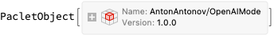
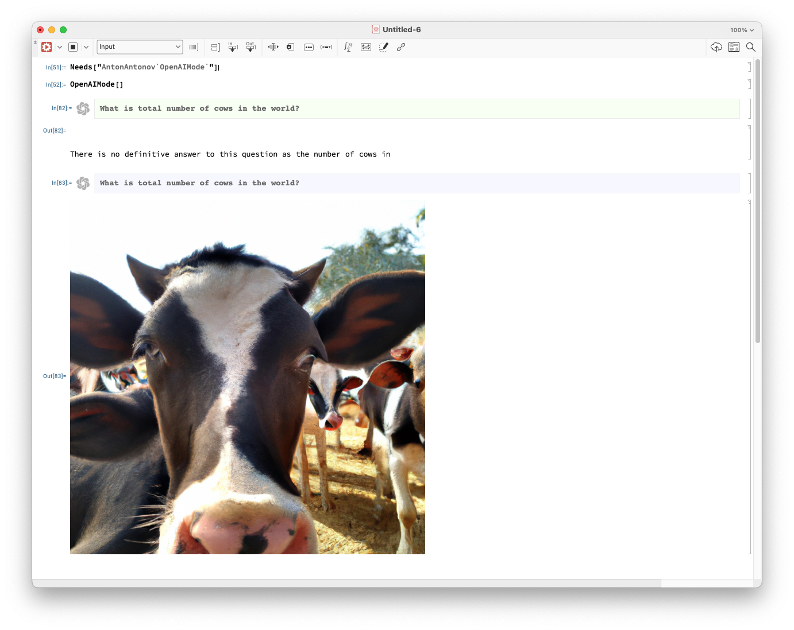
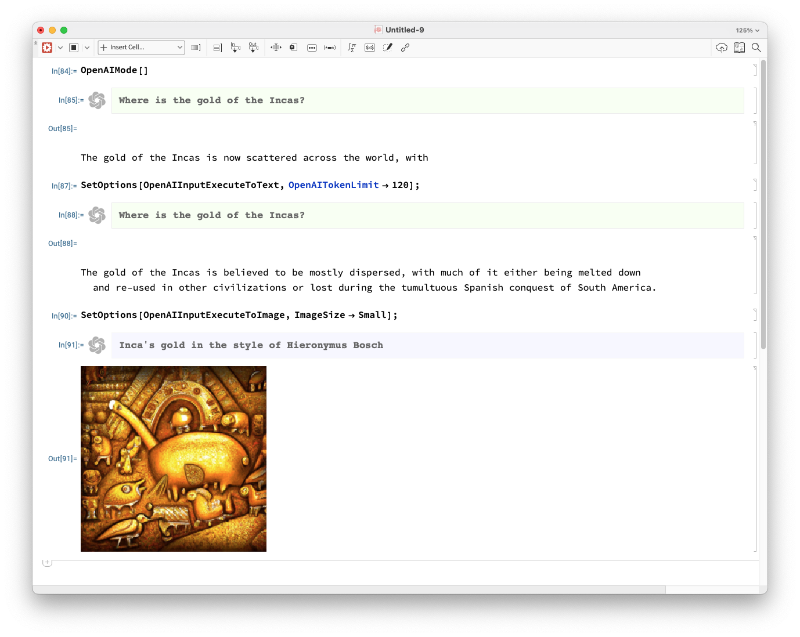
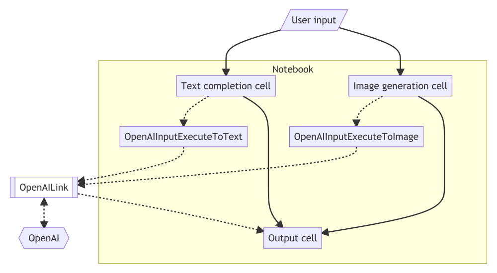

---

# OpenAIMode demo

**...for Mathematica notebooks**

**Anton Antonov   
[MathematicaForPrediction at WordPress](https://mathematicaforprediction.wordpress.com)   
[MathematicaForPrediction at GitHub](https://github.com/antononcube/MathematicaForPrediction)   
April 2023**  

***[Video recording](https://youtu.be/htUIOqcS9uA)***

---

## Setup

- It is assumed that the paclet [OpenAILink](https://resources.wolframcloud.com/PacletRepository/resources/ChristopherWolfram/OpenAILink/) is installed 

    - ... and the required setup steps are completed.

- Install the paclet [OpenAIMode](https://resources.wolframcloud.com/PacletRepository/resources/AntonAntonov/OpenAIMode/)

```mathematica
PacletInstall["AntonAntonov/OpenAIMode"]
```



```mathematica
Needs["AntonAntonov`OpenAIMode`"]
```

---

## Demo

Let us show how the notebook style works:

- Needs

- OpenAIMode

- Text completion cell (shortcut: "Shift-|")

- Tweak invocation parameters with SetOptions

- Image generation cell (shortcuts: "Tab")

### Screenshots





---

## How does it work?

Consider the following flowchart:

```mathematica
ResourceFunction["MermaidJS"]["flowchart TDOpenAI{{OpenAI}}OpenAILink[[\"OpenAILink\"]]TCC[\"Text completion cell\"]IGC[\"Image generation cell\"] OC[\"Output cell\"]UI[/\"User input\"/]UI --> TCCUI --> IGCTCC -.-> OpenAIInputExecuteToText -.-> OpenAILinkIGC -.-> OpenAIInputExecuteToImage -.-> OpenAILinkOpenAILink <-.-> OpenAIOpenAILink -.-> OCTCC --> OCIGC --> OCsubgraph NotebookTCC		OpenAIInputExecuteToTextIGC		OpenAIInputExecuteToImageOCend   ", "PDF", ImageSize -> 1000]
```



---

## Concluding remarks

### Similar work

- DSLMode and [RakuMode](https://community.wolfram.com/groups/-/m/t/2434981)

- [DarkMode](https://resources.wolframcloud.com/FunctionRepository/resources/DarkMode/) and [DraculaTheme](https://resources.wolframcloud.com/FunctionRepository/resources/DraculaTheme/)

### Future plans (...maybe)

More documentation

Should this notebook style functions be part of [OpenAILink](https://resources.wolframcloud.com/PacletRepository/resources/ChristopherWolfram/OpenAILink/)?

Based on feedback:

- Better default options

- Additional OpenAI cells