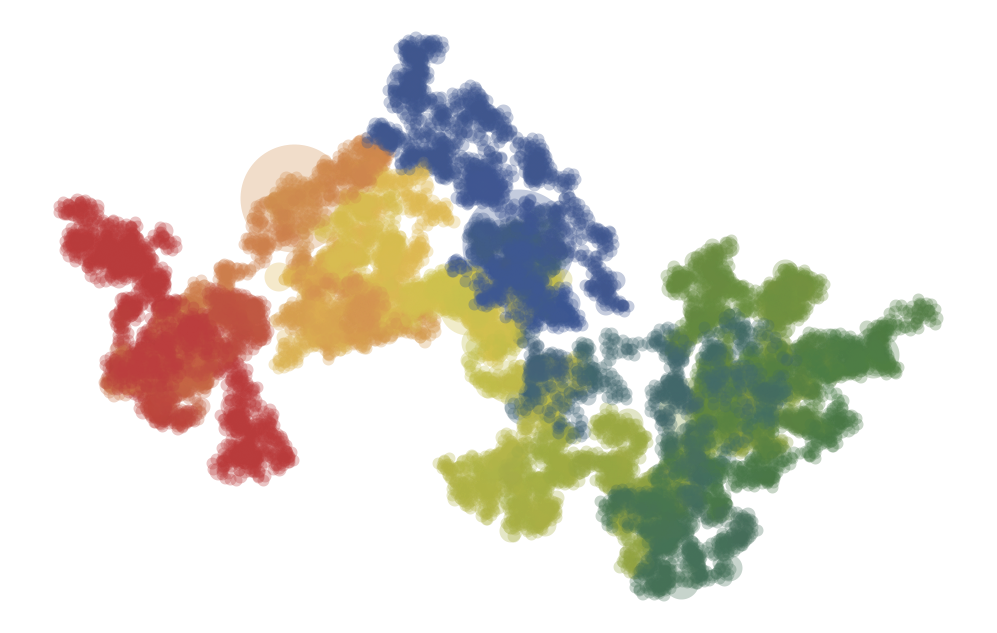
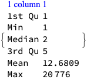
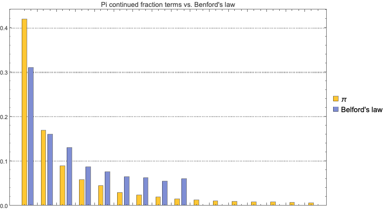
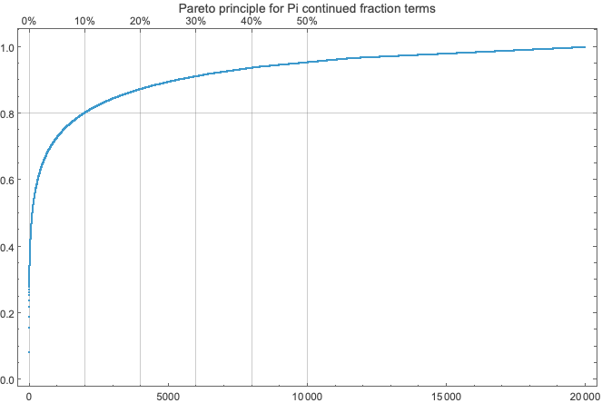
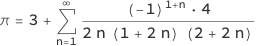
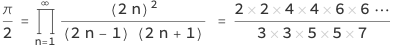
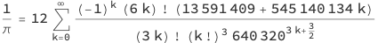
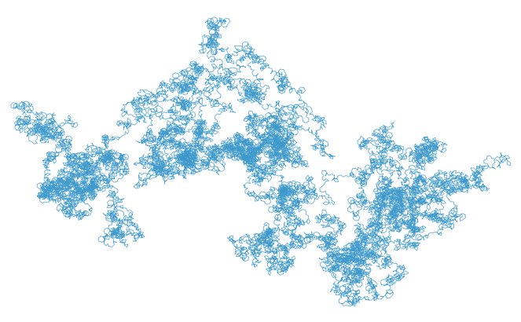
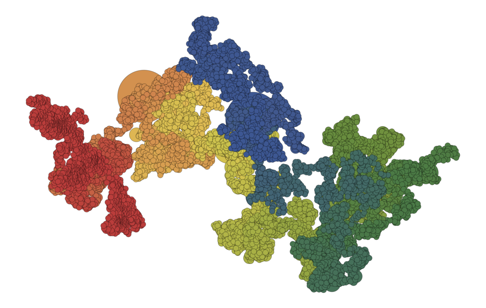
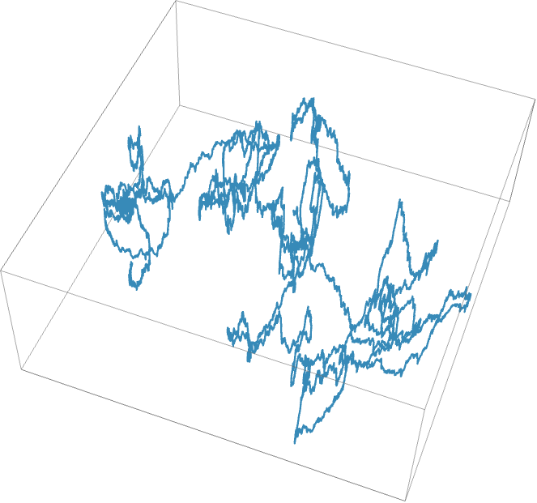

# Pi Day 2026: Formulas, Series, and Plots for π

...Explored in Wolfram Language

Anton Antonov
[MathematicaForPrediction at WordPress](https://mathematicaforprediction.wordpress.com)
[RakuForPrediction at WordPess](https://rakuforprediction.wordpress.com)
March 2026

### Introduction

- Happy Pi Day! Today (3/14) we celebrate the most famous mathematical constant: π ≈ 3.141592653589793...

- π is irrational and transcendental, appears in circles, waves, probability, physics, and even random walks.

- Wolfram Language (with its built-in π constant, excellent rational support, symbolic programming, and vast collection of Number Theory functions) makes experimenting with π especially easy and enjoyable.

- In this notebook we explore a selection of formulas and algorithms.

### 1. Continued fraction approximation

The built-in Wolfram Language (WL) constant Pi (or π ) can be computed to an arbitrary high precision:

```wl
N[Pi, 60]
```

```wl
# 3.14159265358979323846264338327950288419716939937510582097494
```

Let us compare it with a continued fraction approximation. For example, using the (first) sequence line of On-line Encyclopedia of Integer Sequences (OEIS) [A001203](https://oeis.org/A001203) produces π  with precision 100:

```wl
s = {3, 7, 15, 1, 292, 1, 1, 1, 2, 1, 3, 1, 14, 2, 1, 1, 2, 2, 2, 2, 1, 84, 2, 1, 1, 15, 3, 13, 1, 4, 2, 6, 6, 99, 1, 2, 2, 6, 3, 5, 1, 1, 6, 8, 1, 7, 1, 2, 3, 7, 1, 2, 1, 1, 12, 1, 1, 1, 3, 1, 1, 8, 1, 1, 2, 1, 6, 1, 1, 5, 2, 2, 3, 1, 2, 4, 4, 16, 1, 161, 45, 1, 22, 1,2, 2, 1, 4, 1, 2, 24, 1, 2, 1, 3, 1, 2, 1};
N[FromContinuedFraction[s], 120]
```

```wl
# 3.14159265358979323846264338327950288419716939937510582097494459230781640628620899862803482534211706808656553677697242141
```

Here we verify the precision using Wolfram Language:

```wl
N[Pi, 200] - %
```

```wl
# -1.0441745026369011477*10^-100
```

More details can be found in Wolfram MathWorld page ["Pi Continued Fraction"](https://mathworld.wolfram.com/PiContinuedFraction.html) , [EW1].

### 2. Continued fraction terms plots

It is interesting to consider the plotting the terms of continued fraction terms of *\pi* .

First we ingest the more "pi-terms" from OEIS [A001203](https://oeis.org/A001203) (20k terms):

```wl
terms = Partition[ToExpression /@ StringSplit[Import["https://oeis.org/A001203/b001203.txt"], Whitespace], 2][[All, 2]];
Length[terms]
```

```wl
# 20000
```

Here is the summary:

```wl
ResourceFunction["RecordsSummary"][terms]
```



Here is an array plot of the first 128 terms of the continued fraction approximating *\pi* :

```wl
mat = IntegerDigits[terms[[1 ;; 128]], 2];
maxDigits = Max[Length /@ mat];
mat = Map[Join[Table[0, maxDigits - Length[#]], #] &, mat];
```

```wl
ArrayPlot[Transpose[mat], Mesh -> True, ImageSize -> 1000]
```


Next, we show the Pareto principle manifestation of for the continued fraction terms. First we observe that the terms a distribution similar to [Benford's law](https://en.wikipedia.org/wiki/Benford%27s_law) :

```wl
tallyPi = KeySort[AssociationThread @@ Transpose[Tally[terms]]][[1 ;; 16]]/Length[terms];
```

```wl
termsB = RandomVariate[BenfordDistribution[10], 2000];
tallyB = KeySort[AssociationThread @@ Transpose[Tally[termsB]]]/Length[termsB];
```

```wl
data = {tallyPi, tallyB};
data = KeySort /@ Map[KeyMap[ToExpression, #] &, data];
data2 = First /@ Values@Merge[{data[[1]], Join[AssociationThread[Keys[data[[1]]],Null], data[[2]]]}, List];
```

```wl
BarChart[data2, 
   PlotLabel -> "Pi continued fraction terms vs. Benford's law", 
   ChartLegends -> {"\[Pi]", "Belford's law"}, 
   PlotTheme -> "Detailed", ImageSize -> Large]
```



Here is the Pareto principle plot -- ≈5% of the unique term values correspond to ≈80% of the terms:

```wl
ResourceFunction["ParetoPrinciplePlot"][
   terms, 
   PlotLabel -> "Pareto principle for Pi continued fraction terms", 
   ImageSize -> Large]
```



### 3. Classic Infinite Series

Many ways to express π as an infinite sum --- some converge slowly, others surprisingly fast.

**Leibniz--Gregory series** (1671/ Madhava earlier)

$$\pi =4 \sum _{n=0}^{\infty } \frac{(-1)^n}{2 n+1}=4 \left(1-\frac{1}{3}+\frac{1}{5}-\frac{1}{7}+\cdots \right)$$

WL implementation:

```wl
PiLeibniz[n_Integer] := Block[{}, 
    4*Total[Table[(-1)^i/(2 i + 1), {i, 0, n - 1}]] 
   ]
```

```wl
N[PiLeibniz[1000], 20]
```

```wl
# 3.1405926538397929260
```

Verify with Wolfram Language (again):

```wl
N[Pi, 100] - N[PiLeibniz[1000], 1000]
```

```wl
# 0.000999999750000312499046880410106913745780068595381331607486808765908475046461390362862493334446861
```

**[Nilakantha series](https://vixra.org/pdf/2302.0056v1.pdf)**[ ](https://vixra.org/pdf/2302.0056v1.pdf)(faster convergence):



WL:

```wl
PiNilakantha[n_Integer] := Block[{}, 
    3 + 4*Total[Table[(-1)^(i + 1)/(2 i (2 i + 1) (2 i + 2)), {i, 1, n}]] 
   ]
```

```wl
N[PiNilakantha[1000], 20]
```

```wl
# 3.1415926533405420519
```

```wl
N[Pi, 40] - N[PiNilakantha[1000], 40]
```

```wl
# 2.49251186562514647026299317045*10^-10
```

### 3. Beautiful Products

**[Wallis product](https://en.wikipedia.org/wiki/Wallis_product)**[ (1655)](https://en.wikipedia.org/wiki/Wallis_product) --- elegant infinite product:



WL running product:

```wl
 p = 2.0; 
   Do[
    p *= (2 n)^2/((2 n - 1) (2 n + 1)); 
    If[Divisible[n, 100], 
     Print[Row[{n, " -> ", p/\[Pi], " relative error"}]] 
    ], 
    {n, 1, 1000}]
```

```plaintext
|  100 |  ->  | 0.9975155394660373 |  relative error |
|  200 |  ->  | 0.998753895533088  |  relative error |
|  300 |  ->  | 0.9991683995999036 |  relative error |
|  400 |  ->  | 0.9993759752213087 |  relative error |
|  500 |  ->  | 0.9995006243131489 |  relative error |
|  600 |  ->  | 0.9995837669635674 |  relative error |
|  700 |  ->  | 0.9996431757700326 |  relative error |
|  800 |  ->  | 0.9996877439728793 |  relative error |
|  900 |  ->  | 0.9997224150056372 |  relative error |
| 1000 |  ->  | 0.9997501561641055 |  relative error |
```

### 4. Very Fast Modern Series --- [Chudnovsky Algorithm](https://en.wikipedia.org/wiki/Chudnovsky_algorithm)

One of the fastest-converging series used in record computations:



Each term adds roughly 14 correct digits.

### 5. Spigot Algorithms --- Digits "Drip" One by One

[Spigot algorithms](https://en.wikipedia.org/wiki/Spigot_algorithm) compute decimal digits using only integer arithmetic --- no floating-point errors accumulate.

The classic **[Rabinowitz--Wagon spigot](http://stanleyrabinowitz.com/download/spigot-revised.pdf)** (based on a transformed Wallis product) produces base-10 digits sequentially.

Simple (but bounded) version outline in WL:

```wl
ClearAll[PiSpigotDigits, PiSpigotString]; 
  
 PiSpigotDigits[n_Integer?Positive] := 
     Module[{len, a, q, x, i, j, nines = 0, predigit = 0, digits = {}},
      len = Quotient[10 n, 3] + 1; 
      a = ConstantArray[2, len]; 
      For[j = 1, j <= n, j++, q = 0; 
       For[i = len, i >= 1, i--, x = 10 a[[i]] + q i; 
        a[[i]] = Mod[x, 2 i - 1]; 
        q = Quotient[x, 2 i - 1];]; 
       a[[1]] = Mod[q, 10]; 
       q = Quotient[q, 10]; 
       Which[
        q == 9, nines++, 
        
        q == 10, 
        AppendTo[digits, predigit + 1]; 
        digits = Join[digits, ConstantArray[0, nines]]; 
        predigit = 0; 
        nines = 0, 
        
        True, 
        AppendTo[digits, predigit]; 
        digits = Join[digits, ConstantArray[9, nines]]; 
        predigit = q; 
        nines = 0]; 
      ]; 
      
      AppendTo[digits, predigit]; 
      Take[digits, n] 
     ]; 
  
 PiSpigotString[n_Integer?Positive] := Module[{d = PiSpigotDigits[n]}, ToString[d[[2]]] <> "." <> StringJoin[ToString /@ Rest[Rest[d]]]];
```

```wl
PiSpigotString[40]
```

```wl
# "3.14159265358979323846264338327950288419"
```

```wl
N[Pi, 100] - ToExpression[PiSpigotString[40]]
```

```wl
# 0.*10^-38
```

### 6. [BBP Formula](https://mathworld.wolfram.com/BBPFormula.html) --- Hex Digits Without Predecessors

[Bailey--Borwein--Plouffe (1995) formula](https://en.wikipedia.org/wiki/Bailey--Borwein--Plouffe_formula) lets you compute the n-th hexadecimal digit of π directly (without earlier digits):

$$\pmb{\left.\pi =\sum _{k=0}^{\infty } \left[\frac{1}{16^k}\left(\frac{4}{8 k+1}-\frac{2}{8 k+4}-\frac{1}{8 k+5}-\frac{1}{8 k+6}\right)\right.\right]}$$

Very popular for distributed π-hunting projects. The best known [digit-extraction algorithm](https://mathworld.wolfram.com/Digit-ExtractionAlgorithm.html) .

WL snippet for partial sum (base 16 sense):

```wl
ClearAll[BBPTerm, BBPPiPartial, BBPPi]
 BBPTerm[k_Integer?NonNegative] := 16^-k (4/(8 k + 1) - 2/(8 k + 4) - 1/(8 k + 5) - 1/(8 k + 6));
 BBPPiPartial[n_Integer?NonNegative] := Sum[BBPTerm[k], {k, 0, n}];
 BBPPi[prec_Integer?Positive] := 
    Module[{n}, 
     n = Ceiling[prec/4] + 5; 
     N[BBPPiPartial[n], prec] 
    ];
```

```wl
BBPPiPartial[10] // N[#, 20] &
```

```wl
# 3.1415926535897931296
```

```wl
BBPPi[50]
```

```wl
# 3.1415926535897932384626433745157614859702375522676
```

### 7. (Instead of) Conclusion

- π contains (almost surely) every finite sequence of digits --- your birthday appears infinitely often.

- [The Feynman point](https://en.wikipedia.org/wiki/Six_nines_in_pi) : six consecutive 9s starting at digit 762.

- Memorization world record > 100,000 digits.

- π appears in the normal distribution, quantum mechanics, random walks, Buffon's needle problem (probability ≈ 2/π).

Let us plot a "random walk" using the terms of continued fraction of Pi -- the 20k or OEIS [A001203](https://oeis.org/A001203) -- to determine directions:

```wl
ListLinePlot[Reverse /@ AnglePath[terms], PlotStyle -> (AbsoluteThickness[0.6]), ImageSize -> Large, Axes -> False]
```



Here is a bubble chart based on the path points and term values:

```wl
pathWithValues = Flatten /@ Thread[{Reverse /@ Rest[path], terms}];
 gr = BubbleChart[pathWithValues, ChartStyle -> "DarkRainbow", AspectRatio -> Automatic, Frame -> False, Axes -> False, PlotTheme -> "Minimal"];
 Rasterize[gr, ImageSize -> 900, ImageResolution -> 72]
```



**Remark:** The bubble sizes indicate that some of terms are fairly large, but the majority of them are relatively small.

Here is a 3D point plot with of moving average of the 3D path modified to have the logarithms of the term values:

```wl
pathWithValuesLog = MapAt[N@*Log10, pathWithValues, {All, 3}];
 ListLinePlot3D[MovingAverage[pathWithValuesLog, 200], AspectRatio -> Automatic, PlotRange -> All, ImageSize -> Large, Ticks -> None]
```



### References

[EW1] Eric Weisstein, ["Pi Continued Fraction"](https://mathworld.wolfram.com/PiContinuedFraction.html) , [Wolfram MathWorld](https://mathworld.wolfram.com) .