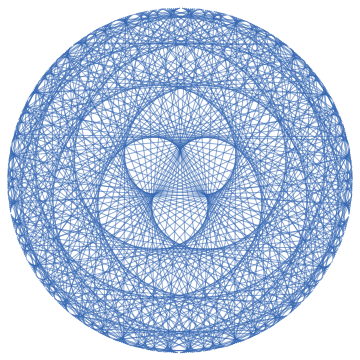
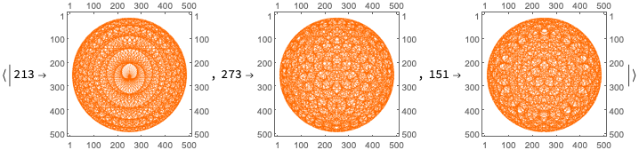
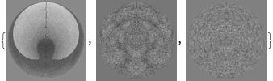

# Primitive roots generation trails

Anton Antonov
[MathematicaForPrediction at WordPress](https://mathematicaforprediction.wordpress.com)
[Wolfram Repository resources](https://resources.wolframcloud.com/publishers/resources?PublisherID=AntonAntonov)
April 2025

## Introduction

In this notebook we show how make neat chord plots of primitive roots generation sequences. [Primitive roots](https://en.wikipedia.org/wiki/Primitive_root_modulo_n) a generators of cyclic [multiplicative integer groups modulo ](https://en.wikipedia.org/wiki/Multiplicative_group_of_integers_modulo_n)$\underline{n}$. See the built-in Wolfram Language functions [PrimitiveRoot](https://reference.wolfram.com/language/ref/PrimitiveRoot.html) and [PrimitiveRootList](https://reference.wolfram.com/language/ref/PrimitiveRootList.html). We follow the ideas presented in [“Modular Arithmetic Visualizations”](http://inversed.ru/Blog_1.htm) by [Peter Karpov](http://inversed.ru/index.htm).

**Remark:** The basis representation section follows ["Re-exploring the structure of Chinese character images"](https://community.wolfram.com/groups/-/m/t/2516662), [AAn1]; the movie exporting section follows [“Rorschach mask animations projected over 3D surfaces”](https://community.wolfram.com/groups/-/m/t/2679216), [AAn2]. 

**Remark:** The motivation for finding and making nice primary root trails came from on working on Number theory neat examples discussed in [AAv1, AAv2].

### Procedure outline

1. Try to figure out neat examples to visualize primitive roots.

    1. Browse [Wolfram Demonstrations](https://demonstrations.wolfram.com/topic/number-theory).

    1. Search [World Wide Web](http://inversed.ru/Blog_1.htm).

2. Program a few versions of circle chords based visualization routines.

    1. Called ***chord trail plots*** below.

3. Marvel at chord trail plots for larger moduli.

    1. Make multiple collections of them.

    1. Look into number of primitive roots distributions.

4. Consider making animations of the collections.

    1. The animations should not be “chaotic” -- they should have some inherent visual flow in them.

5. Consider different ways of sorting chord trail plots.

    1. Using number theoretic arguments.

        1. Yeah, would be nice, but requires too much head scratching and LLM-ing.

    1. Convert plots to images and sort them.

        1. Some might say that that is a “brute force” application.

        1. Simple image sort does not work.

6. Latent Semantic Analysis (LSA) application.

    1. After failing to sort the chord trail image collections by “simple” means, the idea applying LSA came to mind.

    2. LSA being, of course, a favorite technique that was applied to sorting images multiple times in the past, in different contexts, [AAn1, AAn3, AAn4, AAn5, AAv3].

    3. Also, having [a nice (monadic) paclet for doing LSA](https://resources.wolframcloud.com/PacletRepository/resources/AntonAntonov/MonadicLatentSemanticAnalysis/), [AAp1], helps a lot.

7. Make the [animations](https://imgur.com/a/primitive-roots-visualizations-AvM4zJp) and marvel at them.

8. Export the chord trail plots animations for different moduli to movies and GIFs and upload them.

9. Make a blog post (notebook).

-----

## Chord plot

It is fairly easy to program a chord plot using Graph:

```mathematica
(* Modulus and primivite root*)
n = 509; r = 128; 
(* Coordinates of the chords plot*)
coords = AssociationThread[Range[n], Table[{Cos[2 \[Pi] k/(n - 1) + \[Pi]/2], Sin[2 \[Pi] k/(n - 1) + \[Pi]/2]}, {k, 0, n - 1}]]; 
(* Graph edges *) 
edges = UndirectedEdge @@@ Partition[PowerMod[r, #, n] & /@ Range[n], 2, 1]; 
(*Graph*) 
Graph[edges, VertexCoordinates -> coords, VertexSize -> 0, EdgeStyle -> AbsoluteThickness[0.6]]
```


We make the function ChordTrailsGraph (see Section “Setup” below) encapsulating the code above. Here is an example:

```mathematica
ChordTrailsGraph[509, 47, EdgeStyle -> {AbsoluteThickness[0.8`]}, 
 VertexSize -> 0, VertexStyle -> EdgeForm[None], 
 EdgeStyle -> RGBColor[0.6093762755665056`, 0.7055193578067459`, 0.8512829338493225`]]
```



Instead of using Graph we can just a Graphics plot -- again see the definition in “Setup”. Here is an example:

```mathematica
ChordTrails[509, 75, "Color" -> Automatic]
```


Note that the modular inverse is going to produce the same chord trails plot:

```mathematica
Row[{
   ChordTrails[257, 3, ImageSize -> 300], 
   ChordTrails[257, ModularInverse[3, 257], ImageSize -> 300] 
  }]
```


------

## Making collections of plots

Here w pick a large enough modulus, we find the primitive roots, and keep only primitive roots that will produce unique chord trail plots:

```mathematica
n = 509;
rs = PrimitiveRootList[n];
Length[rs]
urs = Select[rs, # <= ModularInverse[#, n] &];
urs // Length

(*252*)

(*126*)
```

Here is the collection using Graph:

```mathematica
AbsoluteTiming[
  gs1 = Association@
      Map[# ->
          ChordTrailsGraph[n, #, EdgeStyle -> {AbsoluteThickness[0.8]},
            VertexSize -> 0, VertexStyle -> EdgeForm[None],
            EdgeStyle -> RGBColor[0.6093762755665056, 0.7055193578067459, 0.8512829338493225],
            ImageSize -> 300] &, urs];
]

(*{0.771692, Null}*)
```

Here is a sample of plots from the collection:

```mathematica
KeyTake[gs1, {2, 48, 69}]
```


Here is the collection using Graphics:

```mathematica
AbsoluteTiming[
  gs2 = Association@Map[# -> ChordTrails[n, #, ImageSize -> 300] &, urs]; 
 ]

(*{1.13483, Null}*)
```

Here is a sample of plots from the collection (same indexes as above):

```mathematica
KeyTake[gs2, {2, 48, 69}]
```


**Remark:** It looks like that using Graph is faster and produces (admittedly, with tweaking options) better looking plots.

Since we want to make an animation of chord-trail plots, we convert the collection of plots into a collection of images:

```mathematica
AbsoluteTiming[
  imgs = Map[Rasterize[#, "Image", RasterSize -> 500, ImageSize -> 600] &, gs2]; 
 ]

(*{15.5664, Null}*)
```

------

## Generalization

The function ChordTrails can be generalized to take a (pre-computed) chords argument. Here is an example of chords plot that connects integers that are modular inverses of each other: 

```mathematica
m = 4000;
chords = Map[If[NumericQ@Quiet@ModularInverse[#, m], {#, ModularInverse[#, m]},Nothing] &, Range[m]];
ChordTrails[m, chords, PlotStyle -> AbsoluteThickness[0.01], ImageSize -> 400]
```


-----

## LSAMon application

In order to sort the plots we find dimension reduction basis representation of the corresponding images and sort using that representation. For more details see [“Re-exploring the structure of Chinese character images”](https://community.wolfram.com/groups/-/m/t/2516662), [AAn1].

```mathematica
Clear[ImagePreProcessing, ImageToVector];
ImagePreProcessing[img_Image] := ColorNegate@Binarize[img, 0.9];
ImageToVector[img_Image] := Flatten[ImageData[ImagePreProcessing[img]]];
ImageToVector[img_Image, imgSize_] := Flatten[ImageData[ColorConvert[ImageResize[img, imgSize], "Grayscale"]]];
ImageToVector[___] := $Failed;
```

```mathematica
aCImages = imgs;
```

```mathematica
AbsoluteTiming[aCImageVecs = ParallelMap[ImageToVector, aCImages];]

(*{0.184429, Null}*)
```

```mathematica
SeedRandom[32];
MatrixPlot[Partition[#, ImageDimensions[aCImages[[1]]][[2]]]] & /@ RandomSample[aCImageVecs, 3]
```



```mathematica
mat = ToSSparseMatrix[SparseArray[Values@aCImageVecs], "RowNames" -> Map[ToString, Keys[aCImageVecs]], "ColumnNames" -> Automatic]
```


```mathematica
SeedRandom[777];
AbsoluteTiming[
  lsaAllObj = 
    LSAMonUnit[]⟹
     LSAMonSetDocumentTermMatrix[mat]⟹
     LSAMonApplyTermWeightFunctions["None", "None", "Cosine"]⟹
     LSAMonExtractTopics["NumberOfTopics" -> 120, Method -> "SVD", "MaxSteps" -> 15, "MinNumberOfDocumentsPerTerm" -> 0]⟹
     LSAMonNormalizeMatrixProduct[Normalized -> Right]; 
 ]

(*{7.56445, Null}*)
```

In case you want to see the basis (we show just a sample):

```mathematica
lsaAllObj⟹
   LSAMonEcho[Style["Sample of the obtained basis:", Bold, Purple]]⟹
   LSAMonEchoFunctionContext[ImageAdjust[Image[Partition[#, ImageDimensions[aCImages[[1]]][[1]]], ImageSize -> Tiny]] & /@ SparseArray[#H[[{2, 11, 60}, All]]] &];
```




```mathematica
W2 = lsaAllObj⟹LSAMonNormalizeMatrixProduct[Normalized -> Right]⟹LSAMonTakeW;
Dimensions[W2]

(*{126, 120}*)
```

```mathematica
H = lsaAllObj⟹LSAMonNormalizeMatrixProduct[Normalized -> Right]⟹LSAMonTakeH;
Dimensions[H]

(*{120, 250000}*)
```

```mathematica
AbsoluteTiming[lsClusters = FindClusters[Normal[SparseArray[W2]] -> RowNames[W2], 40, Method -> {"KMeans"}];]
Length@lsClusters
ResourceFunction["RecordsSummary"][Length /@ lsClusters]

(*{0.2576, Null}*)

(*40*)
```


```mathematica
matPixels = WeightTermsOfSSparseMatrix[lsaAllObj⟹LSAMonTakeWeightedDocumentTermMatrix, "IDF", "None", "Cosine"];
matTopics = WeightTermsOfSSparseMatrix[lsaAllObj⟹LSAMonNormalizeMatrixProduct[Normalized -> Left]⟹LSAMonTakeW, "None", "None", "Cosine"];
```

```mathematica
SeedRandom[33];
ind = RandomChoice[Keys[aCImages]];
imgTest = ImagePreProcessing@aCImages[ind];
matImageTest = ToSSparseMatrix[SparseArray@List@ImageToVector[imgTest, ImageDimensions[aCImages[[1]]]], "RowNames" -> Automatic, "ColumnNames" -> Automatic];
(*imgTest*)
```

```mathematica
H = lsaAllObj⟹LSAMonNormalizeMatrixProduct[Normalized -> Right]⟹LSAMonTakeH;
lsBasis = ImageAdjust[Image[Partition[#, ImageDimensions[aCImages[[1]]][[1]]]]] & /@ SparseArray[H];
```

```mathematica
matReprsentation = lsaAllObj⟹LSAMonRepresentByTopics[matImageTest]⟹LSAMonTakeValue;
lsCoeff = Normal@SparseArray[matReprsentation[[1, All]]];
ListPlot[MapIndexed[Tooltip[#1, lsBasis[[#2[[1]]]]] &, lsCoeff], Filling -> Axis, PlotRange -> All]
```

```mathematica
vecReprsentation = lsCoeff . SparseArray[H];
reprImg = Image[Unitize@Clip[#, {0.45, 1}, {0, 1}] &@Rescale[Partition[vecReprsentation, ImageDimensions[aCImages[[1]]][[1]]]]];
GridTableForm[Binarize@Show[#, ImageSize -> 350] & /@ {imgTest, reprImg}, TableHeadings -> {"Test", "Approximated"}]
```


```mathematica
W = lsaAllObj⟹LSAMonNormalizeMatrixProduct[Normalized -> Left]⟹LSAMonTakeW;
Dimensions[W]

(*{126, 120}*)
```

```mathematica
aWVecs = KeyMap[ToExpression, AssociationThread[RowNames[W], Normal[SparseArray[W]]]];
```

```mathematica
ListPlot[Values@aWVecs[[1 ;; 3]], Filling -> Axis, PlotRange -> All]
```


```mathematica
aWVecs2 = Sort[aWVecs];
```

```mathematica
aWVecs3 = aWVecs[[Ordering[Values@aWVecs]]];
```

## Animate sorted

Here we make the animation of sorted chord trail plots:

```mathematica
ListAnimate[Join[Values[KeyTake[gs, Keys[aWVecs3]]], Reverse@Values[KeyTake[gs, Keys[aWVecs3]]]], DefaultDuration -> 24]
```

Playing the [link to an uploaded movie](https://imgur.com/rleSJqX):

```mathematica
Video["https://www.wolframcloud.com/obj/25b58db2-16f0-4148-9498-d73062387ebb"]
```

[](https://imgur.com/rleSJqX.mp4)

-----

## Export

**Remark:** The code below follows ["Rorschach mask animations projected over 3D surfaces"](https://community.wolfram.com/groups/-/m/t/2679216).

**Remark:** The animations are exported in the subdirectory “AnimatedGIFs”.

#### Export to MP4 (white background)

```mathematica
lsExportImgs = Join[Values[KeyTake[imgs, Keys[aWVecs2]]], Reverse@Values[KeyTake[imgs, Keys[aWVecs2]]]];
```

```mathematica
AbsoluteTiming[
  Export[FileNameJoin[{NotebookDirectory[], "AnimatedGIFs", "PrimitiveRoots-" <> ToString[n] <> ".mp4"}], lsExportImgs, "MP4","DisplayDurations" -> 0.05]; 
 ]
```

#### Export to GIF (black background)

```mathematica
AbsoluteTiming[
  lsExportImgs2 = ColorNegate[ImageEffect[#, "Decolorization"]] & /@ Values[KeyTake[imgs, Keys[aWVecs2]]]; 
 ]
```

```mathematica
lsExportImgs2 = Join[lsExportImgs2, Reverse@lsExportImgs2];
lsExportImgs2 // Length
```

```mathematica
lsExportImgs2[[12]]
```

```mathematica
AbsoluteTiming[
  Export[FileNameJoin[{NotebookDirectory[], "AnimatedGIFs", "PrimitiveRoots-" <> ToString[n] <> ".gif"}], lsExportImgs2, "GIF", "AnimationRepetitions" -> Infinity, "DisplayDurations" -> 0.05]; 
 ]
```

Optionally, open the animations directory:

```mathematica
(*FileNameJoin[{NotebookDirectory[],"AnimatedGIFs"}]//SystemOpen*)
```

------

## Setup

### Load paclets

```mathematica
Needs["AntonAntonov`SSparseMatrix`"];
Needs["AntonAntonov`MonadicLatentSemanticAnalysis`"];
Needs["AntonAntonov`MonadicSparseMatrixRecommender`"];
Needs["AntonAntonov`OutlierIdentifiers`"];
Needs["AntonAntonov`DataReshapers`"];
```

### Chord plots definitions

```mathematica
Clear[ChordTrailsGraph];
Options[ChordTrailsGraph] = Options[Graph];
ChordTrailsGraph[n_Integer, r_Integer, opts : OptionsPattern[]] := 
   Block[{coords, edges, g}, 
    coords = AssociationThread[Range[n], Table[{Cos[2 \[Pi] k/(n - 1) + \[Pi]/2], Sin[2 \[Pi] k/(n - 1) + \[Pi]/2]}, {k, 0, n - 1}]]; 
    edges = UndirectedEdge @@@ Partition[PowerMod[r, #, n] & /@ Range[n], 2, 1]; 
    g = Graph[edges, opts, VertexCoordinates -> coords]; 
    g 
   ];
```

```mathematica
Clear[ChordTrails];
Options[ChordTrails] = Join[{"Color" -> RGBColor[0.4659039108257499, 0.5977704831063181, 0.7964303267504351], PlotStyle -> {}}, Options[Graphics]];
ChordTrails[n_Integer, r_Integer, opts : OptionsPattern[]] :=
  Block[{chords},
   chords = Partition[PowerMod[r, #, n] & /@ Range[n], 2, 1];
   ChordTrails[n, chords, opts]
  ];
ChordTrails[n_Integer, chordsArg : {{_?IntegerQ, _?IntegerQ} ..}, opts : OptionsPattern[]] :=
  Block[{chords = chordsArg, color, plotStyle, coords},
   
   color = OptionValue[ChordTrails, "Color"];
   If[TrueQ[color === Automatic], 
    color = RGBColor[
     0.4659039108257499, 0.5977704831063181, 0.7964303267504351]];
   plotStyle = OptionValue[ChordTrails, PlotStyle];
   If[TrueQ[plotStyle === Automatic], plotStyle = {}];
   plotStyle = Flatten[{plotStyle}];
   
   coords = 
    AssociationThread[Range[n], 
     Table[{Cos[2 \[Pi] k/(n - 1) + \[Pi]/2], 
       Sin[2 \[Pi] k/(n - 1) + \[Pi]/2]}, {k, 0, n - 1}]];
   chords = chords /. {i_Integer :> coords[[i]]};
   Which[
    ColorQ[color],
    Graphics[{Sequence @@ plotStyle, color, Line[chords]}, 
     FilterRules[{opts}, Options[Graphics]]],
    TrueQ[Head[color] === ColorDataFunction],
    Graphics[{Sequence @@ plotStyle, 
      MapIndexed[{color[#2[[1]]/Length[chords]], Line[#1]} &, chords]},
      FilterRules[{opts}, Options[Graphics]]],
    True,
    Echo["Unknown color spec.", "GroupClassChords:"];
    $Failed
    ]
   ];
```

## References

### Articles, posts

[PK1] Peter Karpov, ["Modular Arithmetic Visualizations"](http://inversed.ru/Blog_1.htm), (2016), [Inversed.ru](http://inversed.ru/index.htm).

### Notebooks

[AAn1] Anton Antonov, [“Re-exploring the structure of Chinese character images”](https://community.wolfram.com/groups/-/m/t/2516662), (2022), [Wolfram Community](https://community.wolfram.com).

[AAn2] Anton Antonov,  [“Rorschach mask animations projected over 3D surfaces”](https://community.wolfram.com/groups/-/m/t/2679216), (2022), [Wolfram Community](https://community.wolfram.com).

[AAn3] Anton Antonov, ["Handwritten Arabic characters classifiers comparison"](https://community.wolfram.com/groups/-/m/t/2526901), (2022), [Wolfram Community](https://community.wolfram.com).

[AAn4] Anton Antonov, ["LSA methods comparison over random mandalas deconstruction -- WL"](https://community.wolfram.com/groups/-/m/t/2508248),  (2022), [Wolfram Community](https://community.wolfram.com).

[AAn5] Anton Antonov, ["LSA methods comparison over random mandalas deconstruction -- Python"](https://community.wolfram.com/groups/-/m/t/2508233),  (2022), [Wolfram Community](https://community.wolfram.com).

### Paclets

[AAp1] Anton Antonov, ["MonadicLatentSemanticAnalysis"](https://resources.wolframcloud.com/PacletRepository/resources/AntonAntonov/MonadicLatentSemanticAnalysis/), (2023), [Wolfram Language Paclet Repository](https://resources.wolframcloud.com/PacletRepository).

### Videos

[AAv1] Anton Antonov,[ "Number theory neat examples in Raku (Set 1)"](https://www.youtube.com/watch?v=wXXWyRAAPvc), (2025), [YouTube/@AAA4prediction](https://www.youtube.com/@AAA4prediction).

[AAv2] Anton Antonov, ["Number theory neat examples in Raku (Set 2)”](https://www.youtube.com/watch?v=sMwuGVvkLkU), (2025), [YouTube/@AAA4prediction](https://www.youtube.com/@AAA4prediction).

[AAv3] Anton Antonov, ["Random Mandalas Deconstruction in R, Python, and Mathematica (Greater Boston useR Meetup, Feb 2022)"](https://www.youtube.com/watch?v=nKlcts5aGwY), (2022), [YouTube/@AAA4prediction](https://www.youtube.com/@AAA4prediction).