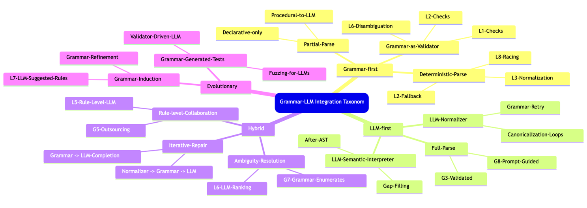
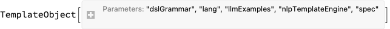
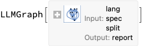
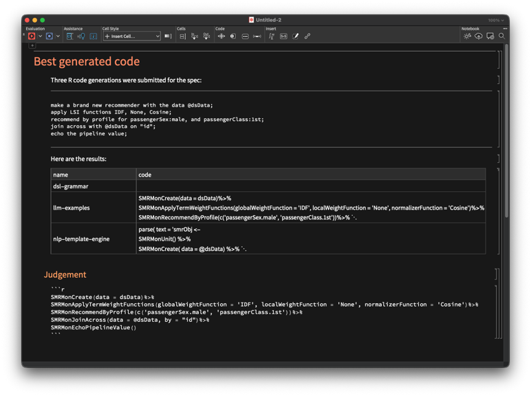
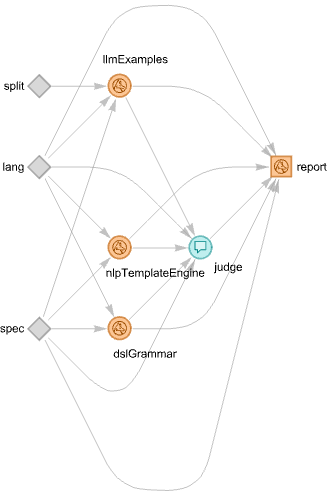
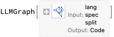
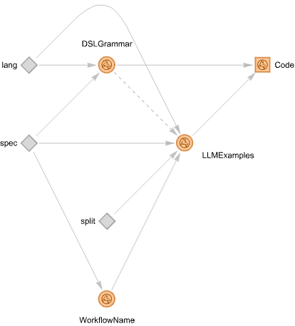

# Robust code generation combining grammars and LLMs

Anton Antonov   
[MathematicaForPrediction at WordPress](https://mathematicaforprediction.wordpress.com)   
[RakuForPrediction at WordPress](https://rakuforprediction.wordpress.com)    
October, December 2025

### Introduction

This notebook discusses different combinations of Grammar-Based Parser-Interpreters (GBPI) and Large Language Models (LLMs) to generate executable code from Natural Language Computational Specifications (NLCM). We have the *soft* assumption that the NLCS adhere to a certain relatively small Domain Specific Language (DSL) or use terminology from that DSL. Another assumption is that the target software packages are not necessarily well-known by the LLMs, i.e. direct LLM requests for code using them would produce meaningless results.

We want to do such combinations because:

- GBPI are fast, precise, but with a narrow DSL scope

- LLMs can be unreliable and slow, but with a wide DSL scope

Because of GBPI and LLMs are complementary technologies with similar and overlapping goals the possible combinations are many. We concentrate on two of the most straightforward designs: (1) judged parallel race of methods execution, and (2) using LLMs as a fallback method if grammar parsing fails. We show [asynchronous programming](https://en.wikipedia.org/wiki/Asynchrony_(computer_programming)) implementations for both designs using the Wolfram Language function [LLMGraph](https://reference.wolfram.com/language/ref/LLMGraph.html).

The Machine Learning (ML) paclet ["MonadicSparseMatrixRecommender"](https://resources.wolframcloud.com/PacletRepository/resources/AntonAntonov/MonadicSparseMatrixRecommender/) is used to demonstrate that the generated code is executable.

The rest of the document is structured as follows:

- Initial grammar-LLM combinations

    - Assumptions, straightforward designs, and trade-offs

- Comprehensive combinations enumeration (attempt)

    - Tabular and morphological analysis breakdown

- Three methods for parsing ML DSL specs into Raku code

    - One grammar-based, two LLM-based

- Parallel execution with an LLM judge

    - Straightforward, but computationally wasteful and expensive

- Grammar-to-LLM fallback mechanism

    - The easiest and most robust solution

- Concluding comments and observations

#### TL;DR

- Combining grammars and LLMs produces robust translators.

- Three translators with different faithfulness and coverage are demonstrated and used.

- Two of the simplest, yet effective, combinations are implemented and demonstrated.

    - Parallel race and grammar-to-LLM fallback.

- Asynchronous implementations with LLM-graphs are a very good fit!

    - Just look at the LLM-graph plots (and be done reading.)

### Initial Combinations and Associated Assumptions

The goal is to combine grammar-based parser-interpreters with LLMs in order to achieve robust parsing and interpretation of computational workflow specifications.

Here are some example combinations of these approaches:

1. A few methods, both grammar-based and LLM-based, are initiated in parallel. Whichever method produces a correct result first is selected as the answer.

    - This approach assumes that when the grammar-based methods are effective, they will finish more quickly than the LLM-based methods.

1. The grammar method is invoked first; if it fails, an LLM method (or a sequence of LLM methods) is employed.

1. LLMs are utilized at the grammar-rule level to provide matching objects that the grammar can work with.

1. If the grammar method fails, an LLM normalizer for user commands is invoked to generate specifications that the grammar can parse.

1. It is important to distinguish between declarative specifications and those that prescribe specific steps.

    - For a workflow given as a list of steps the grammar parser may successfully parse most steps, but LLMs may be required for a few exceptions.

The main trade-off in these approaches is as follows:

- Grammar methods are challenging to develop but can be very fast and precise.

    - Precision can be guaranteed and rigorously tested.

- LLM methods are quicker to develop but tend to be slower and can be unreliable, particularly for less popular workflows, programming languages, and packages.

Also, combinations based on LLM tools (aka LLM external function calling) are not considered because LLM-tools invocation is too unpredictable and unreliable.

### Comprehensive breakdown (attempt)

This section has a "concise" table that expands the combinations list above into the main combinatorial strategies for **Grammar** *** LLMs** for robust parsing and interpretation of workflow specifications. The table is not an exhaustive list of such combinations, but illustrates their diversity and, hopefully, can give ideas for future developments.

A few summary points (for table's content/subject):

- **Grammar (Raku regex/grammar)**

    - **Pros:** fast, deterministic, validated, reproducible

    - **Cons:** hard to design for large domains, brittle for natural language inputs

- **LLMs**

    - **Pros:**  fast to prototype, excellent at normalization/paraphrasing, flexible

    - **Cons:** slow, occasionally wrong, hallucination risk, inconsistent output formats

- **Conclusion:**

    - The most robust systems combine *grammar precision* with *LLM adaptability* , typically by putting grammars first and using LLMs for repair, normalization, expansions, or semantic interpretation (i.e. "fallback".)

#### Table: Combination Patterns for Parsing Workflow Specifications

```wl
tbl = Dataset[{<|"ID" -> 1, "CombinationPattern" -> "Parallel Race: Grammar + LLM", "Description" -> "Launch grammar-based parsing and one or more LLM interpreters in parallel; whichever yields a valid parse first is accepted.", "Pros" -> {"Fast when grammar succeeds", "Robust fallback", "Reduces latency unpredictability of LLMs"}, "ConsTradeoffs" -> {"Requires orchestration", "Need a validator for LLM output"}|>, <|"ID" -> 2, "CombinationPattern" -> "Grammar-First, LLM-Fallback", "Description" -> "Try grammar parser first; if it fails, invoke LLM-based parsing or normalization.", "Pros" -> {"Deterministic preference for grammar", "Testable correctness when grammar succeeds"}, "ConsTradeoffs" -> {"LLM fallback may produce inconsistent structures"}|>, <|"ID" -> 3, "CombinationPattern" -> "LLM-Assisted Grammar (Rule-Level)", "Description" -> "Individual grammar rules delegate to an LLM for ambiguous or context-heavy matching; LLM supplies tokens or AST fragments.", "Pros" -> {"Handles complexity without inflating grammar", "Modular LLM usage"}, "ConsTradeoffs" -> {"LLM behavior may break rule determinism", "Harder to reproduce"}|>, <|"ID" -> 4, "CombinationPattern" -> "LLM Normalizer -> Grammar Parser", "Description" -> "When grammar fails, LLM rewrites/normalizes input into a canonical form; grammar is applied again.", "Pros" -> {"Grammar remains simple", "Leverages LLM skill at paraphrasing"}, "ConsTradeoffs" -> {"Quality depends on normalizer", "Feedback loops possible"}|>, <|"ID" -> 5, "CombinationPattern" -> "Hybrid Declarative vs Procedural Parsing", "Description" -> "Grammar extracts structural/declarative parts; LLM interprets procedural/stepwise parts or vice versa.", "Pros" -> {"Each subsystem tackles what it's best at", "Reduces grammar complexity"}, "ConsTradeoffs" -> {"Harder to maintain global consistency", "Requires AST stitching logic"}|>, <|"ID" -> 6, "CombinationPattern" -> "Grammar-Generated Tests for LLM", "Description" -> "Grammar used to generate examples and counterexamples; LLM outputs are validated against grammar constraints.", "Pros" -> {"Powerful for verifying LLM outputs", "Reduces hallucinations"}, "ConsTradeoffs" -> {"Grammar must encode constraints richly", "Validation pipeline required"}|>, <|"ID" -> 7, "CombinationPattern" -> "LLM as Adaptive Heuristic for Grammar Ambiguities", "Description" -> "When grammar yields multiple parses, LLM chooses or ranks the \"most plausible\" AST.", "Pros" -> {"Improves disambiguation", "Good for underspecified workflows"}, "ConsTradeoffs" -> {"LLM can pick syntactically impossible interpretations"}|>, <|"ID" -> 8, "CombinationPattern" -> "LLM as Semantic Phase After Grammar", "Description" -> "Grammar creates an AST; LLM interprets semantics, fills in missing steps, or resolves vague ops.", "Pros" -> {"Clean separation of syntax vs semantics", "Grammar ensures correctness"}, "ConsTradeoffs" -> {"Semantic interpretation may drift from syntax"}|>, <|"ID" -> 9, "CombinationPattern" -> "Self-Healing Parse Loop", "Description" -> "Grammar fails -> LLM proposes corrections -> grammar retries -> if still failing, LLM creates full AST.","Pros" -> {"Iterative and robust", "Captures user intent progressively"}, "ConsTradeoffs" -> {"More expensive; risk of oscillation"}|>, <|"ID" -> 10, "CombinationPattern" -> "Grammar Embedding Inside Prompt Templates", "Description" -> "Grammar definitions serialized into the prompt, guiding the LLM to conform to the grammar (soft constraints).", "Pros" -> {"Faster than grammar execution in some cases", "Encourages consistent structure"}, "ConsTradeoffs" -> {"Weak guarantees", "LLM may ignore grammar"}|>, <|"ID" -> 11, "CombinationPattern" -> "LLM-Driven Grammar Induction or Refinement", "Description" -> "LLM suggests new grammar rules or transformations; developer approves; the grammar evolves over time.", "Pros" -> {"Faster grammar evolution", "Useful for new workflow languages"}, "ConsTradeoffs" -> {"Requires human QA", "Risk of regressing accuracy"}|>, <|"ID" -> 12, "CombinationPattern" -> "Regex Engine as LLM Guardrail", "Description" -> "Regex or token rules used to validate or filter LLM results before accepting them.", "Pros" -> {"Lightweight constraints", "Useful for quick prototyping"}, "ConsTradeoffs" -> {"Regex too weak for complex syntax"}|>}]; 
  
 tbl = tbl[All, KeyDrop[#, "ID"] &];
 tbl = tbl[All, ReplacePart[#, "Pros" -> ColumnForm[#Pros]] &];
 tbl = tbl[All, ReplacePart[#, "ConsTradeoffs" -> ColumnForm[#ConsTradeoffs]] &];
 tbl = tbl[All, Style[#, FontFamily -> "Times New Roman"] & /@ # &];
 ResourceFunction["GridTableForm"][tbl]
```

|  |  |  |  |  |
| - | - | - | - | - |
| # | CombinationPattern | Description | Pros | ConsTradeoffs |
| 1 | Parallel Race: Grammar + LLM | Launch grammar-based parsing and one or more LLM interpreters in parallel; whichever yields a valid parse first is accepted. | {{Fast when grammar succeeds}, {Robust fallback}, {Reduces latency unpredictability of LLMs}} | {{Requires orchestration}, {Need a validator for LLM output}} |
| 2 | Grammar-First, LLM-Fallback | Try grammar parser first; if it fails, invoke LLM-based parsing or normalization. | {{Deterministic preference for grammar}, {Testable correctness when grammar succeeds}} | {{LLM fallback may produce inconsistent structures}} |
| 3 | LLM-Assisted Grammar (Rule-Level) | Individual grammar rules delegate to an LLM for ambiguous or context-heavy matching; LLM supplies tokens or AST fragments. | {{Handles complexity without inflating grammar}, {Modular LLM usage}} | {{LLM behavior may break rule determinism}, {Harder to reproduce}} |
| 4 | LLM Normalizer -> Grammar Parser | When grammar fails, LLM rewrites/normalizes input into a canonical form; grammar is applied again. | {{Grammar remains simple}, {Leverages LLM skill at paraphrasing}} | {{Quality depends on normalizer}, {Feedback loops possible}} |
| 5 | Hybrid Declarative vs Procedural Parsing | Grammar extracts structural/declarative parts; LLM interprets procedural/stepwise parts or vice versa. | {{Each subsystem tackles what it's best at}, {Reduces grammar complexity}} | {{Harder to maintain global consistency}, {Requires AST stitching logic}} |
| 6 | Grammar-Generated Tests for LLM | Grammar used to generate examples and counterexamples; LLM outputs are validated against grammar constraints. | {{Powerful for verifying LLM outputs}, {Reduces hallucinations}} | {{Grammar must encode constraints richly}, {Validation pipeline required}} |
| 7 | LLM as Adaptive Heuristic for Grammar Ambiguities | When grammar yields multiple parses, LLM chooses or ranks the "most plausible" AST. | {{Improves disambiguation}, {Good for underspecified workflows}} | {{LLM can pick syntactically impossible interpretations}} |
| 8 | LLM as Semantic Phase After Grammar | Grammar creates an AST; LLM interprets semantics, fills in missing steps, or resolves vague ops. | {{Clean separation of syntax vs semantics}, {Grammar ensures correctness}} | {{Semantic interpretation may drift from syntax}} |
| 9 | Self-Healing Parse Loop | Grammar fails -> LLM proposes corrections -> grammar retries -> if still failing, LLM creates full AST. | {{Iterative and robust}, {Captures user intent progressively}} | {{More expensive; risk of oscillation}} |
| 10 | Grammar Embedding Inside Prompt Templates | Grammar definitions serialized into the prompt, guiding the LLM to conform to the grammar (soft constraints). | {{Faster than grammar execution in some cases}, {Encourages consistent structure}} | {{Weak guarantees}, {LLM may ignore grammar}} |
| 11 | LLM-Driven Grammar Induction or Refinement | LLM suggests new grammar rules or transformations; developer approves; the grammar evolves over time. | {{Faster grammar evolution}, {Useful for new workflow languages}} | {{Requires human QA}, {Risk of regressing accuracy}} |
| 12 | Regex Engine as LLM Guardrail | Regex or token rules used to validate or filter LLM results before accepting them. | {{Lightweight constraints}, {Useful for quick prototyping}} | {{Regex too weak for complex syntax}} |

#### Diversity reasons

- The diversity of combinations in the table above arises because Raku grammars and LLMs occupy fundamentally different but highly complementary positions in the parsing spectrum.

- Raku grammars provide determinism, speed, verifiability, and structural guarantees, but they require upfront design and struggle with ambiguity, informal input, and evolving specifications.

- LLMs, in contrast, excel at normalization, semantic interpretation, ambiguity resolution, and adapting to fluid or poorly defined languages, yet they lack determinism, may hallucinate, and are slower.

- When these two technologies meet, every architectural choice --- **who handles syntax, who handles semantics, who runs first, who validates whom, who repairs or refines** --- defines a distinct strategy.

- Hence, the design space naturally expands into many valid hybrid patterns rather than a single "best" pipeline.

- That said, the fallback pattern implemented below can be considered the "best option" from certain development perspectives because it is simple, effective, and has fast execution times.

See the corresponding [Morphological Analysis table](./Diagrams/Robust-code-generation-combining-grammars-and-LLMs/Grammar-LLM-combintations-morphological-analysis-table.md) which correspond to this taxonomy mind-map:

```wl
" mindmap   root(Grammar-LLM Integration Taxonomy)      %% Grammar-first strategies     Grammar-first       Deterministic-Parse         L2-Fallback         L3-Normalization         L8-Racing       Grammar-as-Validator         L1-Checks         L2-Checks         L6-Disambiguation       Partial-Parse         Declarative-only         Procedural-to-LLM      %% LLM-first strategies     LLM-first       Full-Parse         G3-Validated         G8-Prompt-Guided       LLM-Normalizer         Grammar-Retry         Canonicalization-Loops       LLM-Semantic-Interpreter         After-AST         Gap-Filling      %% Coupled / hybrid strategies     Hybrid       Rule-level-Collaboration         L5-Rule-Level-LLM         G5-Outsourcing       Ambiguity-Resolution         L6-LLM-Ranking         G7-Grammar-Enumerates       Iterative-Repair         Normalizer -> Grammar -> LLM         Grammar -> LLM-Completion      %% Evolutionary strategies     Evolutionary       Grammar-Induction         L7-LLM-Suggested-Rules         Grammar-Refinement       Grammar-Generated-Tests         Fuzzing-for-LLMs         Validator-Driven-LLM " // ResourceFunction["MermaidInk"]
```



### Setup

Here are the packages used in this document (notebook):

```wl
Needs["AntonAntonov`DSLTranslation`"];
 Needs["AntonAntonov`NLPTemplateEngine`"];
 Needs["AntonAntonov`DSLExamples`"];
 Needs["AntonAntonov`MermaidJS`"];
 Needs["AntonAntonov`MonadicSparseMatrixRecommender`"];
```

### Three DSL translations

This section demonstrates the use of three different translation methods:

1. Grammar-based parser-interpreter of computational workflows

1. LLM-based translator using few-shot learning with relevant DSL examples

1. Natural Language Processing (NLP) interpreter using code templates and LLMs to fill-in the corresponding parameters

The translators are ordered according of their faithfulness, most faithful first. It can be said that at the same time, the translators are ordered according to their coverage -- widest coverage is by the last.

#### Grammar-based

Here a recommender pipeline specified with natural language commands is translated into Raku code of the package ["ML::SparseMatrixRecommender"](https://raku.land/zef:antononcube/ML::SparseMatrixRecommender) using a sub of the paclet ["DSLTranslation"](https://resources.wolframcloud.com/PacletRepository/resources/AntonAntonov/DSLTranslation/):

```wl
spec = "create from dsData; apply LSI functions IDF, None, Cosine; recommend by profile for passengerSex:male, and passengerClass:1st; join across using dsData; echo the pipeline value";
```

```wl
DSLTranslation[spec, "WLCode" -> True]
```

```wl
Out[]= SMRMonUnit[]==>SMRMonCreate[dsData]==>SMRMonApplyTermWeightFunctions["GlobalWeightFunction" -> "IDF", "LocalWeightFunction" -> "None", "NormalizerFunction" -> "Cosine"]==>SMRMonRecommendByProfile[{"passengerSex:male", "passengerClass:1st"}]==>SMRMonJoinAcross[dsData]==>SMRMonEchoValue[]
```

The function DSLTranslation uses a web service by default but if Raku and the package "DSL::Translators" are installed it can use the provided Command Line Interface (CLI):

```wl
DSLTranslation[spec, "Source" -> "Shell", "CLIPath" -> "~/.rakubrew/shims/dsl-translation"]
```

```wl
Out[]= SMRMonUnit[]==>SMRMonCreate[dsData]==>SMRMonApplyTermWeightFunctions["GlobalWeightFunction" -> "IDF", "LocalWeightFunction" -> "None", "NormalizerFunction" -> "Cosine"]==>SMRMonRecommendByProfile[{"passengerSex:male", "passengerClass:1st"}]==>SMRMonJoinAcross[dsData]==>SMRMonEchoValue[]
```

For more details of the grammar-based approach see the presentations:

- ["Raku for Prediction presentation at The Raku Conference 2021"](https://www.youtube.com/watch?v=flPz4lFyn8M), [AAv1]

- ["Simplified Machine Learning Workflows Overview"](https://www.youtube.com/watch?v=Xy7eV8wRLbE), [AAv2]

#### Via LLM examples

LLM translations can be done using a set of from-to rules. This is the so-called *few shot learning* of LLMs. The paclet ["DSLExamples"](https://resources.wolframcloud.com/PacletRepository/resources/AntonAntonov/DSLExamples/) has a collection of such examples for different computational workflows. (Mostly ML at this point.) The examples are hierarchically organized by programming language and workflow name; see the resource file ["dsl-examples.json"](https://github.com/antononcube/WL-DSLExamples-paclet/blob/main/Kernel/dsl-examples.json), or execute DSLExamples[].

Here is a table that shows the known DSL translation examples in ["DSL::Examples"](https://raku.land/zef:antononcube/DSL::Examples) :

```wl
Dataset[Map[Flatten, List @@@ Normal[ResourceFunction["AssociationKeyFlatten"][Map[Length, DSLExamples[], {2}]]]]][All, AssociationThread[{"Language", "Workflow", "Count"}, #] &]
```

| Language | Workflow | Count |
| - | - | - |
| WL | ClCon | 20 |
| WL | QRMon | 27 |
| WL | LSAMon | 17 |
| WL | SMRMon | 20 |
| Python | QRMon | 23 |
| Python | LSAMon | 15 |
| Python | SMRMon | 20 |
| R | QRMon | 26 |
| R | LSAMon | 17 |
| R | SMRMon | 20 |
| Raku | SMRMon | 20 |

Here is the definition of an LLM translation function that uses examples:

```wl
LLMPipelineSegment[lang_String : "WL", workflow_String : "SMRMon"] := LLMExampleFunction[Normal@DSLExamples[lang, workflow]];
```

Here is a recommender pipeline specified with natural language commands:

```wl
spec = "new recommender; create from @dsData;  apply LSI functions IDF, None, Cosine;  recommend by profile for passengerSex:male, and passengerClass:1st; join across with @dsData on \"id\"; echo the pipeline value; classify by profile passengerSex:female, and passengerClass:1st on the tag passengerSurvival; echo value";
```

```wl
commands = StringSplit[spec, ""];
```

Translate to WL code line-by-line:

```wl
res = LLMPipelineSegment[] /@ commands; res = Map[StringTrim@StringReplace[#, RegularExpression["Output\h*:"] -> ""] &, res];
 res = StringRiffle[res, "==>"]
```

```wl
Out[]= "SMRMonUnit[]==>SMRMonCreate[dsData]==>SMRMonApplyTermWeightFunctions[\"IDF\", \"None\", \"Cosine\"]==>SMRMonRecommendByProfile[{\"passengerSex.male\", \"passengerClass.1st\"}]==>SMRMonJoinAcross[@dsData, \"id\"]==>SMRMonEchoValue[]==>SMRMonClassify[\"passengerSurvival\", {\"passengerSex.female\", \"passengerClass.1st\"}]==>SMRMonEchoValue[]"
```

Or translate by just calling the function over the whole $spec :

```wl
LLMPipelineSegment[][spec]
```

```wl
Out[]= "```wolframSMRMonUnit[] |> SMRMonCreate[dsData] |> SMRMonApplyTermWeightFunctions[\"IDF\", \"None\", \"Cosine\"] |> SMRMonRecommendByProfile[{\"passengerSex\" -> \"male\", \"passengerClass\" -> \"1st\"}] |> SMRMonJoinAcross[dsData, \"id\"] |> SMRMonEchoValue[] |> SMRMonClassify[\"passengerSurvival\", {\"passengerSex\" -> \"female\", \"passengerClass\" -> \"1st\"}] |> SMRMonEchoValue[]```"
```

**Remark:** That latter call is faster, but it needs additional processing for "monadic" workflows.

#### By NLP Template Engine

Here a "free text" recommender pipeline specification is translated to Raku code using the sub concretize of the package ["ML::NLPTemplateEngine"](https://raku.land/zef:antononcube/ML::NLPTemplateEngine) :

```wl
Concretize["create a recommender with dfTitanic; apply the LSI functions IDF, None, Cosine; recommend by profile 1st and male"]
```

```wl
Out[]= Hold[smrObj = SMRMonUnit[]==>SMRMonCreate[None]==>SMRMonRecommendByProfile[{"1st", "male"}, profile]==>SMRMonJoinAcross[None]==>SMRMonEchoValue[];]
```

The paclet ["NLPTemplateEngine"](https://resources.wolframcloud.com/PacletRepository/resources/AntonAntonov/NLPTemplateEngine/) uses a Question Answering System (QAS) implemented in [FindTextualAnswer](https://reference.wolfram.com/language/ref/FindTextualAnswer.html)[.](https://raku.land/zef:antononcube/ML::FindTextualAnswer) A QAS can be implemented in different ways, with different conceptual and computation complexity. "NLPTemplateEngine" also has an LLM based implementation of QAS, [LLMTextualAnswer](https://resources.wolframcloud.com/PacletRepository/resources/AntonAntonov/NLPTemplateEngine/ref/LLMTextualAnswer.html). (Also see [the resource function with the same name](https://resources.wolframcloud.com/FunctionRepository/resources/LLMTextualAnswer/?i=LLMTextualAnswer&searchapi=https%3A%2F%2Fresources.wolframcloud.com%2FFunctionRepository%2Fsearch).)

For more details of the NLP template engine approach see the presentations:

- ["NLP Template Engine, Part 1"](https://www.youtube.com/watch?v=a6PvmZnvF9I), [AAv3]

- ["Natural Language Processing Template Engine"](https://www.youtube.com/watch?v=IrIW9dB5sRM), [AAv4]

### Parallel race (judged): Grammar + LLM

In this section we implement the first, most obvious, and conceptually simplest combination of grammar-based- with LLM-based translations:

- All translators -- grammar-based and LLM-based are run in parallel

- An LLM judge selects the one that adheres best to the given specification

The implementation of this strategy with an LLM graph (say, by using [LLMGraph](https://reference.wolfram.com/language/ref/LLMGraph.html)) is straightforward.

Here is such an LLM graph that:

- Runs all three translation methods above

- There is a judge that picks which on of the LLM methods produced better result

- Judge's output is used to make (and launch) a notebook report

```wl
LLMPipelineSegmentFunction[lang_ : "WL", worflowName_String : "SMRMon"] := LLMExampleFunction[Normal@DSLExamples[][lang][worflowName]];
```

```wl
aLangSeparator = <| "Python" -> ".", "Raku" -> ".", "R" -> "%>%", "WL" -> "==>" |>;
```

```wl
Clear[LLMExamplesTranslation];
 LLMExamplesTranslation[spec_, lang_ : "WL", worflowName_String : "SMRMon", splitQ_ : False] := 
    Module[{llmPipelineSegment, commands}, 
     
     llmPipelineSegment = LLMPipelineSegmentFunction[lang]; 
     
     If[TrueQ@splitQ, 
      Echo["with spec splitting..."]; 
      commands = StringSplit[spec, ""]; 
      StringRiffle[StringTrim@StringReplace[llmPipelineSegment /@ commands, StartOfString ~~ "Output" ~~ ___ ~~ ":" -> ""], aLangSeparator[lang]], 
     (*ELSE*) 
      Echo["no spec splitting..."]; 
      StringReplace[llmPipelineSegment[spec], ";" -> aLangSeparator[lang], Infinity] 
     ] 
    ];
```

```wl
JudgeFunction[spec_, lang_, dslGrammar_, llmExamples_, nlpTemplateEngine_] := 
    StringRiffle[{
      "Choose the generated code that most fully adheres to the spec:", 
      spec, 
      "from the following " <> lang <> " generation results:", "1) DSL-grammar:" <> dslGrammar <> "", 
      "2) LLM-examples:" <> llmExamples <> "", 
      "3) NLP-template-engine:" <> nlpTemplateEngine <> "", 
      "and copy it:" 
     }, 
     "" 
    ];
```

```wl
(*JudgeFunction[`spec`,`lang`,`dslGrammar`,`llmExamples`,`nlpTemplateEngine`]*)
```

```wl
tmplJudge = StringTemplate["Choose the generated code that most fully adheres to the spec:\\n\\n\\n`spec`\\n\\n\\nfrom the following `lang` generation results:\\n\\n\\n1) DSL-grammar:\\n`dslGrammar`\\n\\n\\n2) LLM-examples:\\n`llmExamples`\\n\\n\\n3) NLP-template-engine:\\n`nlpTemplateEngine`\\n\\n\\nand copy it:"]
```



```wl
JudgementReport[spec_, lang_, dslGrammar_, llmExamples_, nlpTemplateEngine_, judge_] := 
    Module[{names, codes, rows, tableHTML, judgementBlock}, 
     names = {"dsl-grammar", "llm-examples", "nlp-template-engine"}; 
     codes = {dslGrammar, llmExamples, nlpTemplateEngine}; 
     rows = MapThread[<|"name" -> #1, "code" -> #2|> &, {names, codes}];
    (*WL analogue of to-html(...,field-names=> <name code>)*) 
     tableHTML = Dataset[rows]; 
     judgementBlock = If[StringContainsQ[judge, "```"], judge, "```" <> lang <> "" <> judge <> "```"]; 
     CreateDocument[{
       TextCell["Best generated code", "Section"], 
       TextCell["Three " <> lang <> " code generations were submitted for the spec:", "Text"], 
       TextCell[spec, "Program"], 
       TextCell["Here are the results:", "Text"], 
       ExpressionCell[tableHTML, "Output"], 
       TextCell["Judgement", "Subsection"], 
       TextCell[judgementBlock, "Output"] 
      }] 
    ];
```

Rules for parallel race:

```wl
rules = <|
     "dslGrammar" -> <|"EvaluationFunction" -> (DSLTranslation[#spec, "ToLanguage" -> #lang, "WLCode" -> False, "Format" -> "CODE"] &), "Input" -> {"spec", "lang"}|>, 
     "llmExamples" -> <|"EvaluationFunction" -> (LLMExamplesTranslation[#spec, #lang, "SMRMon", #split] &), "Input" -> {"spec", "lang", "split"}|>,
     "nlpTemplateEngine" -> <|"EvaluationFunction" -> (Concretize[#spec, "TargetLanguage" -> #lang] &), "Input" -> {"spec", "lang"}|>,
    (*judge-><|EvaluationFunction->(judgeFunction[#spec,#lang,#dslGrammar,#llmExamples,#nlpTemplateEngine]&)|>,*) 
     "judge" -> tmplJudge, 
     "report" -> <|"EvaluationFunction" -> (JudgementReport[#spec, #lang, #dslGrammar, #llmExamples, #nlpTemplateEngine, #judge] &)|> 
    |>;
```

Corresponding LLM-graph construction:

```wl
gBestCode = LLMGraph[rules]
```



Visualization:

```wl

```

Here is a recommender workflow specification:

```wl
spec = " make a brand new recommender with the data @dsData; apply LSI functions IDF, None, Cosine;  recommend by profile for passengerSex:male, and passengerClass:1st; join across with @dsData on \"id\"; echo the pipeline value; ";
```

Here the graph is executed:

```wl
res = gBestCode[<|"spec" -> spec, "lang" -> "R", "split" -> True|>];
```

Here is a screenshot of the LLM-graph result:



#### LLM-graph visualization

```wl
Information[gBestCode, "Graph"]
```



For details on LLM-graphs design see the video:

-  ["Live CEOing Ep 886: Design Review of LLMGraph"](https://www.youtube.com/watch?v=ewU83vHwN8Y), [WRIv1]

### Fallback: DSL-grammar to LLM-examples

Instead of having DSL-grammar- and LLM computations running in parallel, we can make an LLM-graph in which the LLM computations are invoked if the DSL-grammar parsing-and-interpretation fails. In this section we make such a graph.

Before making the graph let us also generalize it to work with other ML workflows, not just recommendations. 

Let us make an LLM function with a similar functionality. I.e. an LLM-function that classifies a natural language computation specification into workflow labels used by ["DSLExamples"](https://resources.wolframcloud.com/PacletRepository/resources/AntonAntonov/DSLExamples/). Here is such a function using the sub [LLMClassify](https://resources.wolframcloud.com/PacletRepository/resources/AntonAntonov/NLPTemplateEngine/ref/LLMClassify.html) provided by ["NLPTemplateEngine"](https://resources.wolframcloud.com/PacletRepository/resources/AntonAntonov/NLPTemplateEngine/):

```wl
lsMLLabels = {"Classification", "Latent Semantic Analysis", "Quantile Regression", "Recommendations"}; 
  
 aWorlflowMonNames = <|
       "Classification" -> "ClCon", 
       "Latent Semantic Analysis" -> "LSAMon", 
       "Quantile Regression" -> "QRMon", 
       "Recommendations" -> "SMRMon" 
     |>; 
  
 LLMWorkflowClassify[spec_] := Module[{res = LLMClassify[spec, lsMLLabels, "Request" -> "which of these workflows characterizes it (just one label)"]}, 
     Lookup[aWorlflowMonNames, res, res] 
   ]
```

```wl
(* Example invocation *)
 (*LLMWorkflowClassify[spec]*)
```

**Remark:** The paclet ["NLPTemplateEngine"](https://resources.wolframcloud.com/PacletRepository/resources/AntonAntonov/NLPTemplateEngine/) has (1) a pre-trained ML workflows classifier, and (2) a separate, generic LLM-based classifier.

Rules for fallback execution:

```wl
TranslationSuccessQ[s_] := StringQ[s] && StringLength[StringTrim[s]] > 5;
 rules = <|
     "DSLGrammar" -> <|"EvaluationFunction" -> (DSLTranslation[#spec, "ToLanguage" -> #lang, "WLCode" -> False, "Format" -> "CODE"] &), "Input" -> {"spec", "lang"}|>, 
     "WorkflowName" -> <|"EvaluationFunction" -> (LLMWorkflowClassify[#spec] &)|>, 
     "LLMExamples" -> <|
       "EvaluationFunction" -> (LLMExamplesTranslation[#spec, #lang, #WorkflowName, #split] &), 
       "Input" -> {"spec", "lang", "WorkflowName", "split"}, 
       "TestFunction" -> (! TranslationSuccessQ[#DSLGrammar] &)|>, 
     "Code" -> <|"EvaluationFunction" -> (If[TranslationSuccessQ[#DSLGrammar], #DSLGrammar, #LLMExamples] &)|> 
    |>;
```

Corresponding LLM-graph construction:

```wl
gRobust = LLMGraph[rules]
```



Here the LLM graph is run over a spec that can be parsed by DSL-grammar (notice the very short computation time):

Here is the obtained result:

Here is a spec that cannot be parsed by the DSL-grammar interpreter -- note that there is just a small language change in the first line:

```wl
spec = " create from @dsData;  apply LSI functions IDF, None, Cosine;  recommend by profile for passengerSex:male, and passengerClass:1st; join across with @dsData on \"id\"; echo the pipeline value; ";
```

Nevertheless, we obtain a correct result via LLM-examples:

```wl
res = gRobust[<|"spec" -> spec, "lang" -> "R", "split" -> True|>]
```

```wl
Out[]= "SMRMonCreate(data = @dsData) %>%SMRMonApplyTermWeightFunctions(globalWeightFunction = \"IDF\", localWeightFunction = \"None\", normalizerFunction = \"Cosine\") %>%SMRMonRecommendByProfile( profile = c(\"passengerSex:male\", \"passengerClass:1st\")) %>%SMRMonJoinAcross( data = @dsData, by = \"id\" ) %>%SMRMonEchoValue()"
```

Here is the corresponding graph plot:

```wl
Information[gRobust, "Graph"]
```



Let us specify another workflow -- for ML-classification with Wolfram Language -- and run the graph:

```wl
spec = " use the dataset @dsData; split the data into training and testing parts with 0.8 ratio; make a nearest neighbors classifier; show classifier accuracy, precision, and recall; echo the pipeline value; ";
```

```wl
res = gRobust[<|"spec" -> spec, "lang" -> "WL", "split" -> True|>]
```

```wl
Out[]= "SMRMonUse[dsData]==>SMRMonSplitData[0.8]==>SMRMonMakeClassifier[\"NearestNeighbors\"]==>SMRMonClassifierMeasurements[\"Accuracy\", \"Precision\", \"Recall\"]==>SMRMonEchoValue[]"
```

### Concluding comments and observations

- Using LLM graphs gives the ability to impose desired orchestration and collaboration between deterministic programs and LLMs.

    - By contrast, the "inversion of control" of LLM - tools is "capricious."

- LLM-graphs are both a generalization of LLM-tools, and a lower level infrastructural functionality than LLM-tools.

- The LLM-graph for the parallel-race translation is very similar to the LLM-graph for comprehensive document summarization described in [AA4].

- The expectation that DSL examples would provide both fast and faithful results is mostly confirmed in ≈20 experiments.

- Using the NLP template engine is also fast because LLMs are harnessed through QAS.

- The DSL examples translation had to be completed with a workflow classifier.

    - Such classifiers are also part of the implementations of the other two approaches .  

    - The grammar - based one uses a deterministic classifier, [AA1] 

    -  The NLP template engine uses an LLM classifier .  

- An interesting extension of the current work is to have a grammar-LLM combination in which when the grammar fails then the LLM "normalizes" the specs until the grammar can parse them.

    - Currently, LLMGraph does not support graphs with cycles, hence this approach "can wait" (or be implemented by other means .)

- Multiple DSL examples can be efficiently derived by random sentence generation with different grammars.

    - Similar to the DSL commands classifier making approach taken in [AA1] .  

- LLMs can be also used to improve and extend the DSL grammars.

    - And it is interesting to consider automating that process, instead of doing it via human supervision.

- This notebook is the Wolfram Language version of the document ["Day 6 -- Robust code generation combining grammars and LLMs"](https://raku-advent.blog/2025/12/06/day-6-robust-code-generation-combining-grammars-and-llms/), [AA6], ([notebook](https://github.com/antononcube/RakuForPrediction-blog/blob/main/Notebooks/Jupyter/Robust-code-generation-combining-grammars-and-LLMs.ipynb)), using Raku.

### References

#### Articles, blog posts

[AA1] Anton Antonov, ["Fast and compact classifier of DSL commands"](https://rakuforprediction.wordpress.com/2022/07/31/fast-and-compact-classifier-of-dsl-commands/) , (2022), [RakuForPrediction at WordPress](https://rakuforprediction.wordpress.com/) .

[AA2] Anton Antonov, ["Grammar based random sentences generation, Part 1"](https://rakuforprediction.wordpress.com/2023/01/23/grammar-based-random-sentences-generation-part-1/) , (2023), [RakuForPrediction at WordPress](https://rakuforprediction.wordpress.com/) .

[AA3] Anton Antonov, ["LLM::Graph"](https://rakuforprediction.wordpress.com/2025/08/23/llmgraph/) , (2025), [RakuForPrediction at WordPress](https://rakuforprediction.wordpress.com/) .

[AA4] Anton Antonov, ["Agentic-AI for text summarization"](https://rakuforprediction.wordpress.com/2025/09/02/agentic-ai-for-text-summarization/) , (2025), [RakuForPrediction at WordPress](https://rakuforprediction.wordpress.com/) .

[AA5] Anton Antonov, ["LLM::Graph plots interpretation guide"](https://rakuforprediction.wordpress.com/2025/09/12/llmgraph-plots-interpretation-guide/) , (2025), [RakuForPrediction at WordPress](https://rakuforprediction.wordpress.com/) .

[AA6] Anton Antonov, ["Day 6 -- Robust code generation combining grammars and LLMs"](https://raku-advent.blog/2025/12/06/day-6-robust-code-generation-combining-grammars-and-llms/), (2025), [Raku Advent Calendar at WordPress](https://raku-advent.blog).

#### Packages

[AAp1] Anton Antonov, [DSL::Translators, Raku package](https://github.com/antononcube/Raku-DSL-Translators) , (2020-2025), [GitHub/antononcube](https://github.com/antononcube) .

[AAp2] Anton Antonov, [ML::FindTextualAnswer, Raku package](https://github.com/antononcube/Raku-ML-FindTextualAnswer/) , (2023-2025), [GitHub/antononcube](https://github.com/antononcube) .

[AAp3] Anton Antonov, [MLP::NLPTemplateEngine, Raku package](https://github.com/antononcube/Raku-ML-NLPTemplateEngine/) , (2023-2025), [GitHub/antononcube](https://github.com/antononcube) .

[AAp4] Anton Antonov, [DSL::Examples, Raku package](https://github.com/antononcube/Raku-DSL-Examples) , (2024-2025), [GitHub/antononcube](https://github.com/antononcube) .

[AAp5] Anton Antonov, [LLM::Graph, Raku package](https://github.com/antononcube/Raku-LLM-Graph) , (2025), [GitHub/antononcube](https://github.com/antononcube) .

[AAp6] Anton Antonov, [ML::SparseMatrixRecommender, Raku package](https://github.com/antononcube/Raku-ML-SparseMatrixRecommender/) , (2025), [GitHub/antononcube](https://github.com/antononcube) .

#### Videos

[AAv1] Anton Antonov, ["Raku for Prediction presentation at The Raku Conference 2021"](https://www.youtube.com/watch?v=flPz4lFyn8M), (2021), [YouTube/@AAA4prediction](https://www.youtube.com/@AAA4prediction) .

[AAv2] Anton Antonov, ["Simplified Machine Learning Workflows Overview"](https://www.youtube.com/watch?v=Xy7eV8wRLbE), (2022), [YouTube/@WolframResearch](https://www.youtube.com/@WolframResearch) .

[AAv3] Anton Antonov, ["NLP Template Engine, Part 1"](https://www.youtube.com/watch?v=a6PvmZnvF9I) , (2021), [YouTube/@AAA4prediction](https://www.youtube.com/@AAA4prediction) .

[AAv4] Anton Antonov, ["Natural Language Processing Template Engine"](https://www.youtube.com/watch?v=IrIW9dB5sRM) , (2023), [YouTube/@WolframResearch](https://www.youtube.com/@WolframResearch) .

[WRIv1] Wolfram Research, Inc., ["Live CEOing Ep 886: Design Review of LLMGraph"](https://www.youtube.com/watch?v=ewU83vHwN8Y) , (2025), [YouTube/@WolframResearch](https://www.youtube.com/@WolframResearch) .